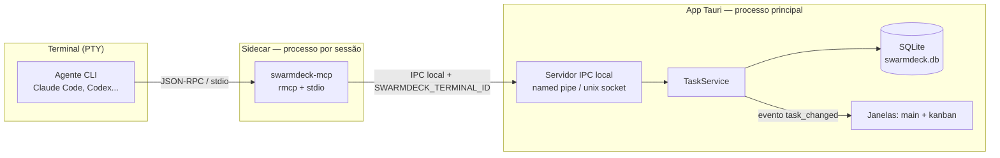
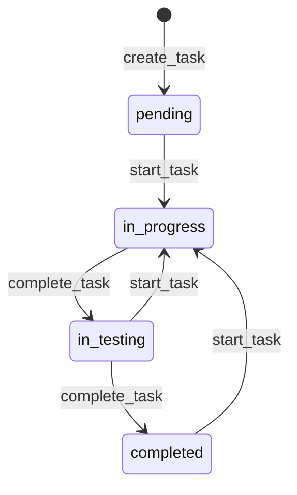

# Servidor MCP de tarefas — Design

**Spec**: `.specs/features/mcp-task-server/spec.md`
**Status**: Draft

> Este é o documento **espinha dorsal** do sistema: define o canal agente↔app, o esquema de dados de tarefas e como as mudanças chegam à UI. `task-kanban/design.md` e `terminal-statuses` dependem dele.

---

## Pesquisa

| Item | Achado | Fonte |
|---|---|---|
| SDK Rust de MCP | `rmcp` é o **SDK oficial** do Model Context Protocol para Rust, sob a org `modelcontextprotocol`. API dirigida por macros. >4,7M downloads no crates.io. | [github.com/modelcontextprotocol/rust-sdk](https://github.com/modelcontextprotocol/rust-sdk) · [crates.io/crates/rmcp](https://crates.io/crates/rmcp) |
| Transporte | Pluggable. O caso comum é o servidor rodando **como subprocesso**, falando JSON-RPC sobre **stdio**. Também há Streamable HTTP e transporte de processo-filho. | [docs.rs/rmcp](https://docs.rs/rmcp/latest/rmcp/) |
| Versão do protocolo | Acompanha o rascunho 2026-07-28, compatível com o estável 2025-11-25 e anteriores. | [rust-sdk README](https://github.com/modelcontextprotocol/rust-sdk/blob/main/crates/rmcp/README.md) |

**Consequência decisiva:** o agente de CLI **spawna** seus servidores MCP como subprocesso stdio. Logo o servidor **não pode ser o app Tauri**, que já está rodando. Ele tem que ser um binário sidecar separado — e esse sidecar precisa de um caminho de volta até o app vivo.

---

## Arquitetura



**Fluxo de uma chamada** (`create_task`):
1. Agente chama a tool via stdio → `swarmdeck-mcp`
2. Sidecar lê `SWARMDECK_TERMINAL_ID` do próprio ambiente (injetado pelo `TerminalManager` no spawn do PTY) e encaminha ao app pelo socket local
3. `TaskService` resolve o projeto pelo `cwd` daquele terminal, grava no SQLite
4. App emite `task_changed` para todas as janelas → o Kanban atualiza

**Por que o app é a autoridade, e não o sidecar escrevendo direto no banco:** com N sidecars gravando no SQLite ao mesmo tempo haveria contenção de lock e — pior — **nenhum caminho para empurrar a mudança para a UI**. O requisito KAN-02 (refletir em < 1s, sem refresh) exige que o processo que possui as janelas seja quem escreve.

---

## `check_active` cai fora de graça

O handshake não precisa de mecanismo próprio: **é o resultado da tentativa de conexão ao socket local.**

| Situação | Socket | Resposta |
|---|---|---|
| Agente dentro de um terminal do app | conecta, `SWARMDECK_TERMINAL_ID` válido | `active: true` + id do terminal |
| Agente em terminal externo | env var ausente | `active: false`, sem nem tentar conectar |
| App fechado / crashou | conexão recusada | `active: false` |

Isso satisfaz MCP-01 e MCP-03 sem código de detecção especial — falha de conexão **é** a resposta negativa. É também a razão de o sidecar nunca poder derrubar o trabalho do agente: qualquer erro de transporte vira `active: false`.

---

## Reuso

| Componente | Origem | Como usar |
|---|---|---|
| `rmcp` | crate oficial | Toda a camada de protocolo: definição de tools, schema, loop JSON-RPC. **Não implementar MCP na mão.** |
| macros do `rmcp` | crate | `#[tool]` gera o schema JSON das ferramentas a partir das assinaturas Rust — evita esquema divergindo da implementação |
| `interprocess` ou `tokio::net` | crate | Named pipe no Windows, Unix socket nos demais |
| `rusqlite` + `serde` | crates | Persistência e serialização |
| `TerminalManager` | `.specs/features/multi-terminal/design.md` | Fonte de `cwd` e estado do terminal, para resolver projeto |

### Pontos de integração

| Sistema | Integração |
|---|---|
| Multi-terminal | Injeta `SWARMDECK_TERMINAL_ID` no env do PTY; expõe `cwd` para resolução de projeto |
| Kanban | Consome o evento `task_changed`; nunca lê o banco por polling |
| Terminal Statuses | `set_terminal_status` valida contra o catálogo **capturado no início da sessão** (STAT-04) |
| Projetos | `TaskService` chama a resolução por diretório na criação da tarefa |

---

## Componentes

### `swarmdeck-mcp` (binário sidecar)
- **Propósito**: expor as ferramentas MCP ao agente e encaminhá-las ao app.
- **Local**: `crates/swarmdeck-mcp/src/main.rs`
- **Interfaces**: as tools da tabela abaixo, via stdio
- **Dependências**: `rmcp`, cliente IPC
- **Reusa**: `#[tool]` do `rmcp` para schema automático
- **Regra**: **sem estado e sem lógica de negócio.** Só traduz MCP → IPC. Toda decisão é do app.

### `IpcServer` (Rust, no app)
- **Propósito**: aceitar conexões dos sidecars.
- **Local**: `src-tauri/src/ipc/server.rs`
- **Interfaces**:
  - `serve(state: AppHandle)` — escuta no named pipe / socket
  - `handle(req: McpRequest) -> McpResponse`
- **Dependências**: `TaskService`, `TerminalManager`
- **Segurança**: socket com escopo de usuário; recusa requisição cujo `terminal_id` não corresponda a uma sessão viva. Sem isso, qualquer processo local escreveria no board.

### `TaskService` (Rust)
- **Propósito**: dono das regras de tarefa — transições, validação, resolução de projeto.
- **Local**: `src-tauri/src/tasks/service.rs`
- **Interfaces**:
  - `create(terminal: TerminalId, title, description) -> Task`
  - `start(id) -> Task` — força `in_progress` **de qualquer estado** (MCP-02)
  - `complete(id) -> Task` — `in_progress → in_testing`, `in_testing → completed` (MCP-03)
  - `update_plan(id, text)` / `update_implementation(id, text)`
  - `find_related(query, threshold) -> Vec<(Task, f32)>`
- **Dependências**: `rusqlite`, resolução de projeto
- **Nota**: a máquina de estados vive **aqui**, não no sidecar — assim a regra vale igual para agente e para UI.

### `TerminalMetaService` (Rust)
- **Propósito**: título, atividade e status do terminal.
- **Local**: `src-tauri/src/terminal/meta.rs`
- **Interfaces**:
  - `set_title(id, title, long_title)` — **descarta se `title_source = 'user'`** (MCP-06)
  - `push_activity(id, text)` — anexa ao log, **não toca no título** (MCP-04)
  - `set_status(id, status_id)` — valida contra o catálogo da sessão (MCP-05)

---

## Catálogo de ferramentas

| Tool | Entrada | Efeito |
|---|---|---|
| `check_active` | — | `{active, terminal_id?}` |
| `create_task` | `title`, `description?` | Cria em `pending`; terminal e projeto inferidos |
| `start_task` | `task_id` | → `in_progress` de qualquer estado |
| `update_task_plan` | `task_id`, `plan` | Grava plano |
| `update_task_implementation` | `task_id`, `implementation` | Grava implementação |
| `complete_task` | `task_id` | `in_progress`→`in_testing`; `in_testing`→`completed` |
| `find_related_active_tasks` | `query` | Tarefas ativas com score de similaridade |
| `search_tasks` / `list_tasks` | `query` / `status?`,`limit`,`offset` | Consulta paginada |
| `set_terminal_title` | `title`, `long_title` | Rótulo estável da aba |
| `update_terminal_activity` | `activity` | Anexa ao log |
| `set_terminal_status` | `status` | Aplica badge |
| `get_projects` / `create_project` / `get_project_tasks` | — | Operações de projeto |

> ⚠️ **Nomes ainda não confirmados.** Foram inferidos das instruções globais do usuário, não de documentação do protocolo do original. Registrado como bloqueio em `STATE.md` — confirmar **antes** de implementar. O `rmcp` gera o schema a partir das assinaturas, então renomear depois é barato no código, mas caro nos prompts que o usuário já tem.

---

## Modelos de dados

```sql
CREATE TABLE tasks (
  id             INTEGER PRIMARY KEY AUTOINCREMENT,  -- o "#2" do card
  title          TEXT NOT NULL,
  description    TEXT,
  plan           TEXT,
  implementation TEXT,
  status         TEXT NOT NULL CHECK(status IN
                   ('pending','in_progress','in_testing','completed')),
  project_id     TEXT REFERENCES projects(id) ON DELETE SET NULL,
  terminal_id    TEXT,              -- origem; sobrevive ao fechamento do terminal
  created_at     INTEGER NOT NULL,
  updated_at     INTEGER NOT NULL
);
CREATE INDEX idx_tasks_status  ON tasks(status);
CREATE INDEX idx_tasks_project ON tasks(project_id);

CREATE TABLE projects (
  id         TEXT PRIMARY KEY,
  name       TEXT NOT NULL,
  path       TEXT NOT NULL UNIQUE,
  color      TEXT NOT NULL,
  last_used  INTEGER
);

CREATE TABLE terminal_statuses (
  id          TEXT PRIMARY KEY,
  label       TEXT NOT NULL,
  color       TEXT NOT NULL,
  instruction TEXT NOT NULL,      -- o texto que ensina o agente QUANDO usar
  sort_order  INTEGER NOT NULL,
  enabled     INTEGER NOT NULL DEFAULT 1,
  is_default  INTEGER NOT NULL DEFAULT 0
);

CREATE TABLE terminal_activity (
  id          INTEGER PRIMARY KEY AUTOINCREMENT,
  terminal_id TEXT NOT NULL,
  activity    TEXT NOT NULL,
  created_at  INTEGER NOT NULL
);
CREATE INDEX idx_activity_terminal ON terminal_activity(terminal_id, created_at DESC);
```

`ON DELETE SET NULL` em `project_id` implementa a regra "tarefa sobrevive à exclusão do projeto" (borda de `projects`). `terminal_id` é texto solto, sem FK — a tarefa deve sobreviver ao fechamento do terminal.

### Máquina de estados



Não existe aresta `in_progress → completed`. A regra de negócio mais importante do produto é aplicada pela **ausência de uma transição**, não por uma checagem que dá para esquecer.

---

## Tratamento de erros

| Cenário | Tratamento | Impacto no agente |
|---|---|---|
| App não está rodando | Conexão recusada | `active: false` — agente segue sem gerenciar tarefas |
| `terminal_id` ausente no env | Sidecar nem conecta | `active: false` |
| `terminal_id` não bate com sessão viva | `IpcServer` recusa | Erro descritivo; nada é gravado |
| `complete_task` em tarefa inexistente | `TaskService` retorna erro | Mensagem clara; **não cria** a tarefa |
| Transição inválida | Recusada pela máquina de estados | Erro nomeando a transição válida |
| Status desconhecido/desativado | Recusado | Erro **com a lista de status válidos** (MCP-05) |
| Duas sessões escrevem na mesma tarefa | Transação SQLite serializa; última vence | Nenhum; registro nunca corrompe |
| Sidecar morre | Agente respawna na próxima chamada | Transitório |
| Plano/implementação grande demais | Trunca e sinaliza | Agente é informado do truncamento |

---

## Decisões técnicas

| Decisão | Escolha | Razão |
|---|---|---|
| Onde roda o servidor MCP | **Sidecar separado**, não embutido no app | O agente de CLI spawna servidores MCP como subprocesso stdio. Um app já rodando não pode ser esse subprocesso. Não há alternativa. |
| Sidecar → app | IPC local (named pipe / unix socket) | O app precisa possuir a escrita para poder empurrar `task_changed` às janelas. Escrita direta no banco pelo sidecar impossibilitaria KAN-02. |
| Lógica no sidecar | Nenhuma — só proxy | Regra duplicada em dois binários diverge. Uma autoridade só. |
| Identificação do terminal | Variável de ambiente no spawn do PTY | Mesmo mecanismo observado no original (`CODEAGENTSWARM_CURRENT_QUADRANT`). Simples e à prova de falsificação acidental. |
| Implementação do MCP | `rmcp` oficial | SDK oficial, macros geram schema a partir do código, acompanha o rascunho atual do protocolo |
| Id de tarefa | `INTEGER AUTOINCREMENT` | O card mostra `#2` — números curtos e legíveis importam mais que unicidade global aqui |
| Propagação do catálogo de status | Snapshot no início da sessão | A própria UI do original diz "Changes reach agents on their next session". Trocar o catálogo no meio quebraria uma sessão em andamento. |
| Autorização do socket | Escopo de usuário + validação de terminal vivo | Sem isso qualquer processo local escreve no board |

---

## Riscos

- **Nomes das tools não confirmados** — bloqueio já registrado. Confirmar antes de codificar.
- **Named pipe no Windows vs Unix socket** têm semântica diferente de permissão. A camada de transporte precisa ser abstraída desde o começo, não adaptada depois.
- **Similaridade de tarefas** (MCP-07): a spec fala em limiares de 70%/50%, mas não define o algoritmo. Começar com trigram/Levenshtein normalizado sobre título+descrição e calibrar contra casos reais — embedding é exagero para o volume esperado.
