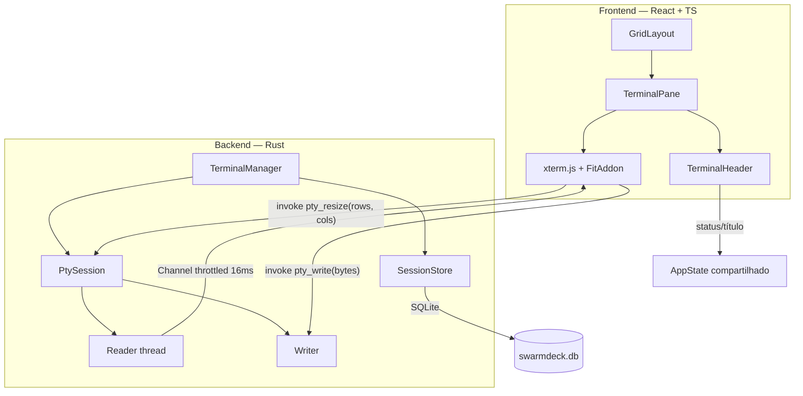

# Multi-terminal em grid — Design

**Spec**: `.specs/features/multi-terminal/spec.md`
**Status**: Draft

---

## Pesquisa

Verificado antes de projetar (cadeia: docs oficiais → web):

| Item | Achado | Fonte |
|---|---|---|
| `portable-pty` | Cross-platform (macOS/Linux/Windows ConPTY). Expõe `native_pty_system()`, `PtyPair`, `pair.slave.spawn_command(cmd)`, `MasterPty::resize(PtySize{rows, cols, pixel_width, pixel_height})`, `try_clone_reader()`, `take_writer()`, e ciclo de vida via `try_wait`/`wait`/`kill`/`process_id`. Faz parte do wezterm. | [docs.rs/portable-pty](https://docs.rs/portable-pty) |
| ConPTY no Windows | Precisa de flags específicas para comportamento correto: `PSEUDOCONSOLE_RESIZE_QUIRK` (corrige artefato de resize), `PSEUDOCONSOLE_WIN32_INPUT_MODE`, e `PSEUDOCONSOLE_PASSTHROUGH_MODE` (repassa VT direto, Win11 22H2+) | [docs.rs/portable-pty](https://docs.rs/portable-pty) |
| Tauri 2 IPC | `Channel` é o mecanismo **recomendado** para streaming — mais eficiente que emitir centenas de eventos. Tauri 2 suporta Raw Requests (bytes crus, sem overhead de JSON). Recomendação explícita: **limitar a taxa** ao que o front consegue renderizar. | [v2.tauri.app/develop/calling-rust](https://v2.tauri.app/develop/calling-rust/) · [tauri#7146](https://github.com/tauri-apps/tauri/discussions/7146) |

**Consequência direta no design:** saída do PTY vai por `Channel` com bytes crus e *throttle* no lado Rust — não por `emit`. Essa é a decisão de performance mais importante da feature.

---

## Arquitetura



Uma thread de leitura bloqueante por PTY (a API do `portable-pty` é síncrona), com um agregador que acumula bytes e despeja no `Channel` em intervalos fixos.

---

## Reuso

Projeto novo — não há código a reaproveitar. O que se aproveita é **infraestrutura externa**:

| Componente | Origem | Como usar |
|---|---|---|
| `portable-pty` | crate (wezterm) | Toda a camada de PTY. Não escrever abstração própria sobre ConPTY/openpty. |
| `xterm.js` + `@xterm/addon-fit` | npm | Emulação e renderização. `FitAddon` calcula rows/cols a partir do tamanho do painel. |
| `tauri-plugin-store` ou tabela SQLite | Tauri / rusqlite | Persistência de layout. Ver decisão abaixo. |
| `AppState` do Tauri (`Manager::state`) | Tauri 2 | Registro de sessões compartilhado entre comandos, sem singleton global. |
| `tauri-plugin-dialog` | plugin oficial Tauri 2 | Seletor nativo de pasta (`TERM-10`). Chamado do frontend via `@tauri-apps/plugin-dialog` (`open({ directory: true, defaultPath })`) — sem comando Rust próprio para abrir o diálogo em si, só para ler/gravar o último diretório (`TERM-11`). Identificador exato da permission a confirmar contra a doc do plugin ao implementar (baseline esperado: `dialog:default` ou `dialog:allow-open`, no `capabilities/default.json`) — não fabricado aqui. |

### Pontos de integração

| Sistema | Integração |
|---|---|
| Servidor MCP de tarefas | Injeta `SWARMDECK_TERMINAL_ID` no ambiente do PTY no spawn. É o que permite ao agente saber em qual terminal está. Ver `.specs/features/mcp-task-server/design.md`. |
| Status de terminal | `TerminalHeader` lê o status do `AppState`, escrito pelo canal MCP. |
| Projetos | O diretório de trabalho da sessão resolve o projeto. Ver `.specs/features/projects/spec.md`. |
| Worktrees | Quando ativo, o diretório de trabalho da sessão é o do worktree, não o do repo. |
| Seleção de agente | O passo AGENT (após PROJECT) e o `resume: true` do "Restore Selected" (TERM-12) são especificados em `.specs/features/agent-selection/spec.md` (AGT-06) — este design não duplica a lógica de retomada de sessão do agente, só a aciona. |

---

## Componentes

### `TerminalManager` (Rust)
- **Propósito**: dono de todas as sessões PTY vivas; única porta de entrada para criar, escrever, redimensionar e matar.
- **Local**: `src-tauri/src/terminal/manager.rs`
- **Interfaces**:
  - `spawn(cfg: SessionConfig) -> Result<TerminalId>` — cria PTY, injeta env, inicia thread leitora
  - `write(id: TerminalId, data: &[u8]) -> Result<()>`
  - `resize(id: TerminalId, rows: u16, cols: u16) -> Result<()>`
  - `kill(id: TerminalId) -> Result<()>`
  - `list() -> Vec<TerminalSnapshot>`
- **Dependências**: `portable-pty`, `AppState`, `SessionStore`
- **Reusa**: `native_pty_system()` — sem camada própria por SO

### `PtySession` (Rust)
- **Propósito**: encapsula um par PTY e o ciclo de vida do processo filho.
- **Local**: `src-tauri/src/terminal/session.rs`
- **Interfaces**:
  - `new(size: PtySize, cmd: CommandBuilder) -> Result<Self>`
  - `attach_channel(ch: Channel<Vec<u8>>)` — liga a saída ao front
  - `status() -> SessionStatus` (`Running | Exited(code) | Failed(msg)`)
- **Dependências**: `portable-pty`, thread dedicada de leitura
- **Reusa**: `try_clone_reader()` / `take_writer()` / `resize()`

### `OutputThrottle` (Rust)
- **Propósito**: impedir que um processo verboso (build, `cat` de arquivo grande) inunde a IPC e trave a UI.
- **Local**: `src-tauri/src/terminal/throttle.rs`
- **Interfaces**:
  - `push(bytes: &[u8])` — acumula em buffer
  - `flush_tick()` — despeja no `Channel` a cada 16ms (≈1 quadro)
- **Dependências**: `tauri::ipc::Channel`
- **Nota**: implementa diretamente a recomendação de rate limiting da documentação do Tauri. Buffer com teto — ao estourar, descarta o **começo** e marca truncamento, porque o que importa é a saída mais recente.

### `GridLayout` (React)
- **Propósito**: dispõe os painéis e gerencia divisórias arrastáveis.
- **Local**: `src/components/grid/GridLayout.tsx`
- **Interfaces**:
  - `<GridLayout panes={Pane[]} onResize={(id, frac) => void} />`
- **Dependências**: estado de layout, `ResizeObserver`
- **Nota**: layout por fração (`0..1`), nunca por pixel — sobrevive a mudança de tamanho de janela e de monitor.

### `TerminalPane` (React)
- **Propósito**: casa uma instância de xterm.js com uma sessão do backend.
- **Local**: `src/components/terminal/TerminalPane.tsx`
- **Interfaces**:
  - `<TerminalPane terminalId={string} />`
- **Dependências**: `xterm.js`, `FitAddon`, `Channel` do Tauri
- **Comportamento**: no mount abre o `Channel` e escreve tudo que chega direto no `Terminal.write()`. No `ResizeObserver`, roda `fit()` e manda `pty_resize` com **debounce de 100ms** — resize é caro no ConPTY.

### `TerminalHeader` (React)
- **Propósito**: identidade e ações do terminal.
- **Local**: `src/components/terminal/TerminalHeader.tsx`
- **Dependências**: `AppState` (título, atividade, status), estado de git

### `terminal::picker_prefs` (Rust) — TERM-11
- **Propósito**: lembrar o último diretório escolhido no seletor de pasta, entre sessões do app.
- **Local**: `src-tauri/src/terminal/picker_prefs.rs`
- **Interfaces**:
  - `last_dir(conn) -> Result<Option<String>>`
  - `set_last_dir(conn, path: &str) -> Result<()>` — upsert de linha única
- **Reusa**: mesmo padrão de `agents::prefs` (`agent_prefs`, linha única `id = 1`, não seedada — ausência de linha = "nunca escolhido") — ver `agent_prefs.rs`
- **Dependências**: nova tabela `terminal_picker_prefs` (migração `005`)

### `NewTerminalDialog` (React) — TERM-10, TERM-11

**Correção 03/08/2026** (observação ao vivo — `.specs/research/screenshots/Captura de tela 2026-08-03 003525.png`): este componente **não é um modal flutuante**. Ele renderiza **dentro do slot de terminal vazio**, no lugar onde o terminal ainda não iniciado mostraria "INITIALIZE AGENT". O passo PROJECT (lista de projetos, busca, New/Import/No Project — `projects/spec.md` PROJ-06/PROJ-07) é o primeiro passo desse mesmo componente; o botão "Import Project" é o que aciona o comportamento abaixo. O único elemento que continua sendo um modal de verdade, sobreposto à janela inteira, é "Create New Project" (`projects/spec.md` PROJ-01).

- **Propósito**: campo "Diretório" deixa de ser texto livre e vira somente-leitura, preenchido pelo seletor nativo de pasta.
- **Local**: `src/components/terminal/NewTerminalDialog.tsx` (modifica) — nome do arquivo mantido por continuidade de código; o componente deixou de ser um diálogo, é um painel de passos dentro do `TerminalPane`
- **Comportamento**: botão "Import Project" chama `open({ directory: true, defaultPath })` do `@tauri-apps/plugin-dialog`, usando `defaultPath` = resultado de `invoke('terminal_picker_last_dir')` lido ao montar o painel. Seleção bem-sucedida seta `cwd` e chama `invoke('terminal_picker_set_last_dir', { path })`; `null` (cancelado) limpa `cwd`. Botão "criar" desabilitado enquanto `cwd` estiver vazio.

### `RestoreSessionModal` (React) — TERM-12

- **Propósito**: no boot, se o fechamento anterior não foi limpo, oferece escolher quais terminais (com sessão de agente) retomar.
- **Local**: `src/components/terminal/RestoreSessionModal.tsx` (novo)
- **Interfaces**: `<RestoreSessionModal candidates={RestorableTerminal[]} maxSlots={4} onRestore={(ids: TerminalId[]) => void} onStartFresh={() => void} />`
- **Comportamento**: lista `candidates` com checkbox pré-marcado; contador "N/M selected · K terminal slots available" recalcula a cada toggle (`K = maxSlots - N`, nunca negativo — desabilita novos checks ao chegar em 0); "Restore Selected" chama `pty_spawn` para cada id marcado, passando `resume: true` (mesmo parâmetro de AGT-06); "Start Fresh" ignora `candidates` e não spawna nada.
- **Dependências**: `terminal::shutdown` (Rust, abaixo), catálogo de agentes (para o ícone de cada linha)

### `terminal::shutdown` (Rust) — TERM-12

- **Propósito**: distinguir fechamento limpo de fechamento inesperado, e listar o que é restaurável.
- **Local**: `src-tauri/src/terminal/shutdown.rs`
- **Interfaces**:
  - `mark_clean_shutdown(conn) -> Result<()>` — chamado no handler de fechamento da janela principal, antes do `kill` de todos os PTYs
  - `was_clean(conn) -> Result<bool>` — lido no boot, antes de recriar terminais
  - `restorable_candidates(conn) -> Result<Vec<RestorableTerminal>>` — lê `terminal_layout` (última foto salva) e monta a lista para o modal
- **Comportamento**: um flag de linha única (`app_shutdown_state`, mesmo padrão de `agent_prefs`/`terminal_picker_prefs`) é setado como "sujo" (`clean = 0`) logo no boot e só vira `clean = 1` no shutdown limpo. Se o processo morrer no meio (crash, kill -9, queda de energia), o flag nunca chega a `1`, e o próximo boot encontra `clean = 0` → fechamento inesperado.
- **Dependências**: nova tabela `app_shutdown_state` (migração — próximo número livre a checar no momento da implementação, mesma regra de "quem chegar primeiro pega o número" já registrada em `EXECUTION.md`)

---

## Modelos de dados

```typescript
type TerminalId = string  // uuid v7 — ordenável por criação

interface SessionConfig {
  cwd: string
  agent: AgentId | null       // null = shell puro
  shell: string               // resolvido do SO se ausente
  env: Record<string, string> // inclui SWARMDECK_TERMINAL_ID
  worktreeId: string | null
}

interface TerminalSnapshot {
  id: TerminalId
  index: number               // #1..#4, o número exibido
  title: string | null        // definido pelo agente
  titleSource: 'agent' | 'user'  // 'user' sempre vence
  longTitle: string | null
  activity: string | null     // atividade mais recente
  status: StatusId | null
  agent: AgentId | null
  cwd: string
  projectId: string | null
  git: { branch: string, changes: number } | null
  state: 'running' | 'exited' | 'failed'
}
```

```sql
-- migração 005 — TERM-11
CREATE TABLE terminal_picker_prefs (
  id       INTEGER PRIMARY KEY,   -- fixo em 1, mesmo padrão de agent_prefs
  last_dir TEXT                   -- NULL = nunca escolhido (não seedada)
);
```

```sql
-- migração a numerar — TERM-12
CREATE TABLE app_shutdown_state (
  id    INTEGER PRIMARY KEY,   -- fixo em 1, mesmo padrão de agent_prefs / terminal_picker_prefs
  clean INTEGER NOT NULL DEFAULT 0   -- 0 = sujo (setado no boot), 1 = fechamento limpo (setado no shutdown)
);
```

`RestorableTerminal` (montado a partir de `terminal_layout` + catálogo de agentes + projeto, não uma tabela própria):

```typescript
interface RestorableTerminal {
  terminalId: TerminalId
  agentId: AgentId
  projectId: string | null   // null = era "No Project" / Sandbox
  projectName: string        // "Sandbox" quando projectId é null
  conversationTitle: string | null  // "Untitled conversation" quando ausente
  selected: boolean           // pré-marcado true
}
```

```sql
CREATE TABLE terminal_layout (
  id            TEXT PRIMARY KEY,
  slot          INTEGER NOT NULL,     -- posição no grid
  frac_w        REAL NOT NULL,        -- fração da largura
  frac_h        REAL NOT NULL,
  cwd           TEXT NOT NULL,
  agent_id      TEXT,
  title         TEXT,
  title_source  TEXT NOT NULL DEFAULT 'agent',
  minimized     INTEGER NOT NULL DEFAULT 0,
  updated_at    INTEGER NOT NULL
);
```

`titleSource` é o que implementa TERM-06 / STAT-07 ("rename manual vence o agente") — sem essa coluna a regra não é aplicável.

---

## Tratamento de erros

| Cenário | Tratamento | O que o usuário vê |
|---|---|---|
| Shell não existe / falha no spawn | `spawn` retorna `Err`; sessão nasce em `failed` | Mensagem dentro do painel, com o comando tentado. Sem modal. |
| Processo morre sozinho | Thread leitora vê EOF, marca `exited(code)` | Painel mostra código de saída e botão de reabrir |
| Buffer de saída estoura | Descarta o início, marca truncamento | Aviso discreto "saída truncada" no topo do scrollback |
| `resize` falha | Loga e mantém o tamanho anterior | Nada — degrada em silêncio, é transitório |
| CLI do agente ausente no PATH | Abre com shell puro | Aviso no painel explicando o que faltou (AGT-04) |
| App fecha com PTYs vivos | `kill` em todos no shutdown, com timeout, depois force-kill | Nada — mas nenhum processo órfão fica |
| Diretório persistido sumiu | Abre em home | Aviso nomeando o diretório que sumiu |
| Seletor nativo de pasta falha ao abrir (TERM-10) | Campo "Diretório" mantém o valor anterior à tentativa | Nada — o painel de inicialização do terminal segue aberto e utilizável |
| Último diretório usado (TERM-11) não existe mais no disco | `defaultPath` do seletor cai para home | Nada — seletor abre em home silenciosamente, mesma lógica de `TERM-07.3` |
| Restaurar terminal cujo diretório sumiu (TERM-12) | Mesma regra de `TERM-07.3` — abre em home e avisa | Aviso nomeando o diretório que sumiu, terminal ainda é criado |
| Restaurar terminal cujo agente não existe mais no PATH (TERM-12) | Mesma regra de AGT-04 — abre com shell puro | Aviso no painel explicando o que faltou, sem bloquear a restauração dos demais |
| Selecionar mais terminais do que `maxSlots` no modal de restauração | Checkbox extra fica desabilitado | "0 terminal slots available" impede marcar mais um |

---

## Decisões técnicas

| Decisão | Escolha | Razão |
|---|---|---|
| Transporte da saída do PTY | `tauri::ipc::Channel` com bytes crus | A documentação do Tauri recomenda `Channel` explicitamente para streaming; `emit` por chunk gera overhead de JSON e derruba a UI sob saída volumosa |
| Frequência de flush | Agregação em janelas de 16ms | Alinha com o quadro de tela. Aplica a orientação de rate limiting do Tauri: emitir mais rápido que o render é desperdício puro |
| Debounce de resize | 100ms | ConPTY tem custo real em resize; arrastar divisória dispararia dezenas de chamadas |
| Estado do layout | Tabela SQLite, não `tauri-plugin-store` | O app já carrega SQLite para tarefas. Um mecanismo de persistência a menos, e permite consultar layout junto de projeto/terminal na mesma transação |
| Identificador | UUID v7 | Ordenável por tempo de criação — dá ordem estável de terminais de graça |
| Threads de leitura | Uma thread bloqueante por PTY | A API do `portable-pty` é síncrona. Ponte para async custaria complexidade sem ganho com no máximo 4 sessões |
| Flags do ConPTY | **Nada a fazer — o crate já resolve** | ⚠️ Corrigido em 28/07/2026 após ler o código de `portable-pty` 0.9.0. Ver nota abaixo. |
| Reanexar a PTY após reiniciar | Não suportado | Impossível: o processo morre com o app. Só o layout e o `cwd` são restaurados (decidido na spec) |

---

## Nota sobre os flags do ConPTY (corrigido em 28/07/2026)

A pesquisa inicial dizia que "criação moderna de ConPTY exige `PSEUDOCONSOLE_RESIZE_QUIRK`, `WIN32_INPUT_MODE` e `PASSTHROUGH_MODE`", e o design original tratava isso como trabalho nosso. **Ler o código do crate desmentiu.** Em `portable-pty-0.9.0/src/win/psuedocon.rs`:

```rust
(CONPTY.CreatePseudoConsole)(
    size, input, output,
    PSUEDOCONSOLE_INHERIT_CURSOR
    | PSEUDOCONSOLE_RESIZE_QUIRK
    | PSEUDOCONSOLE_WIN32_INPUT_MODE,
    &mut con,
)
```

Consequências:
- **`RESIZE_QUIRK` e `WIN32_INPUT_MODE` já vêm ligados**, hardcoded. Não há nada a implementar.
- **`PASSTHROUGH_MODE` não é setado e não é configurável** — a assinatura de `PsuedoCon::new` não aceita flags. Habilitá-lo exigiria fork do crate.
- A detecção de versão de Windows que o design previa **não tem onde ser aplicada** e foi removida do escopo do T4.

Se o passthrough vier a fazer falta (repasse direto de VT em Win11 22H2+), as opções são fork do `portable-pty` ou uma PR upstream — decisão para quando houver sintoma concreto, não agora.

## ⚠️ Handshake de DSR no Windows (descoberto em 28/07/2026, ao implementar T4)

`portable-pty` cria o ConPTY com `PSUEDOCONSOLE_INHERIT_CURSOR`. Esse flag faz o ConPTY, logo na abertura, emitir `ESC[6n` — a consulta DSR de posição de cursor — e **bloquear o processo filho até receber a resposta** `ESC[<linha>;<coluna>R`.

Consequência para o produto: **o frontend é obrigado a responder ao DSR.** Se o caminho `master → Channel → xterm.js → pty_write → master` estiver quebrado em qualquer ponto, o terminal não trava com erro — ele simplesmente **nunca produz saída**, e o processo filho nunca termina. É uma falha silenciosa que parece "terminal lento".

- Em produção o xterm.js responde sozinho, desde que a saída chegue nele **e** o retorno do teclado esteja ligado antes da primeira escrita.
- Em teste não existe terminal, então `tests/session.rs` emula a resposta (`pump_until` / `pump_until_exit`).

Isso foi descoberto do jeito caro: a suíte ficou 20 minutos pendurada sem nenhuma mensagem antes de o `wait` sem prazo ser trocado por um com limite.

**Impacto no T7 (`TerminalPane`)**: o `Channel` de saída e o `pty_write` do teclado precisam estar ligados **antes** de o processo começar a produzir — não depois, num `useEffect` posterior.

## Riscos

- **4 threads bloqueantes de leitura** é aceitável no alvo atual. Se o limite de terminais subir muito, isso vira um pool.
- **Se o front deixar de responder ao DSR**, todo terminal no Windows nasce mudo. Sem teste automatizado que pegue isso hoje — o teste de integração emula a resposta, então não prova que o front a envia.
- **Sem `PASSTHROUGH_MODE`**, sequências VT de programas no Windows 11 22H2+ passam pelo tradutor do ConPTY em vez de irem diretas. Na prática isso raramente aparece; se aparecer, o sintoma é artefato de renderização em TUIs complexas.

---

> Nota: as recomendações de diagrama do skill sugerem a skill `mermaid-studio` para renderizar/validar diagramas. Ela não está instalada — os diagramas aqui são blocos mermaid inline.
