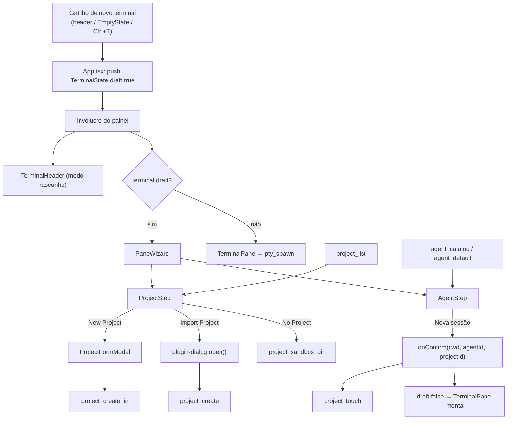
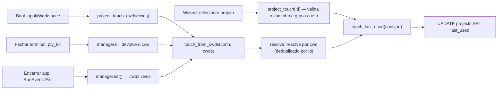

# Projects Design

**Spec**: `.specs/features/projects/spec.md`
**Status**: Draft

---

## Architecture Overview

O backend desta feature já existe e está desligado. O trabalho é ligar
`src-tauri/src/projects/` à UI, escrever a coluna `last_used` que nunca teve
escritor, e trocar o modal de novo terminal por um wizard de duas etapas que
mora **dentro** do painel.

A decisão estrutural é uma só: `TerminalHeader` já é irmão de `TerminalPane`
dentro do mesmo invólucro de painel (`App.tsx:738-776`), então "painel existe"
e "PTY vivo" podem ser separados por um ternário no corpo do painel, sem que o
ciclo de vida do PTY ganhe um único ramo nulo.



Os quatro momentos que escrevem `last_used` convergem para uma função só. Só o
primeiro nasce no frontend; os outros três são backend puro.



---

## Code Reuse Analysis

O grosso desta feature é fiação. A tabela abaixo é o que **não** precisa ser
escrito.

### Componentes existentes a aproveitar

| Componente | Localização | Como usar |
| ---------- | ----------- | --------- |
| `create_with_options(name, base_dir, color, git_init)` | `src-tauri/src/projects/service.rs:180` | Já cria a subpasta, valida a cor e roda `git init`. Cobre PROJ-18 inteiro; falta só o comando Tauri e a remoção da pasta órfã. |
| `create(name, path)` | `src-tauri/src/projects/service.rs:132` | É exatamente o "Import Project": registra uma pasta que já existe. Nenhuma mudança. |
| `list_all`, `get`, `update`, `delete` | `src-tauri/src/projects/service.rs:227-306` | `update` já aceita `name`/`color` opcionais — cobre PROJ-20 sem tocar em Rust. |
| `sandbox::sandbox_dir` | `src-tauri/src/projects/sandbox.rs` | Módulo inteiro escrito para PROJ-07, sem nenhum chamador. Cobre PROJ-16; falta só o comando. |
| `resolve::resolve(cwd, &[Project])` | `src-tauri/src/projects/resolve.rs:41` | Casa `cwd` com o projeto mais específico, separador- e caixa-insensível no Windows. É o que dispensa a coluna `project_id` nos três gatilhos que só conhecem o `cwd`. |
| `TerminalManager::kill(id)` | `src-tauri/src/terminal/manager.rs:183` | Já remove a `Entry`, que carrega o `cwd`. Todo fechamento de terminal passa por aqui (`TerminalPane` chama `pty_kill` na limpeza do efeito), então é o ponto único de PROJ-14 AC16 — em vez de repetir o write nos três handlers de fechamento do `App.tsx`. |
| `TerminalManager::list()` | `src-tauri/src/terminal/manager.rs:196` | Já devolve o `cwd` de toda sessão viva. O gancho de encerramento lê daqui e não precisa perguntar nada ao frontend (PROJ-14 AC17). |
| `require_existing_dir` | `src-tauri/src/projects/service.rs:345` | Já canonicaliza e tira o prefixo verbatim do Windows. Reusado por PROJ-13 AC15. |
| `sortByLastUsed`, `filterProjects`, `truncatePath` | `src/routes/settings/ProjectsPanel.tsx:36,46,26` | Já exportados e testados. `sortByLastUsed` já joga `last_used` nulo para o fim — é metade de PROJ-10 AC2. |
| `TerminalHeader` | `src/components/terminal/TerminalHeader.tsx` | Já é irmão de `TerminalPane`; ganha um modo com ações reduzidas em vez de um componente novo. |
| Catálogo de agentes | `src-tauri/src/agents/catalog.rs:55`, comando `agent_catalog` | Os 5 agentes de `print/project_final.png` são exatamente `CATALOG`. `agent_default` já dá o padrão efetivo. |
| Padrão de modal | `src/App.tsx:973` (`.app-dialog-backdrop`) | Backdrop já existe e continua em uso pelo `RestoreSessionDialog`. `ProjectFormModal` reusa a classe. |
| Padrão de estilo | 14 componentes com bloco `<style>` próprio | Componentes novos carregam o próprio CSS, com `var(--surface, #131318)` e fallback, como os existentes. |

### Pontos de integração

| Sistema | Método de integração |
| ------- | -------------------- |
| Tabela `projects` (migração `003_tasks.sql:20`) | Nenhuma migração nova. `last_used` já existe e é anulável. |
| `terminal_layout` | Nenhuma coluna nova. O `cwd` gravado continua sendo a única identidade de lugar. |
| `terminal_workspace_set` | O payload passa a ser filtrado por `!draft` antes de serializar. |
| `terminal_picker_prefs` | Continua servindo os seletores de "Import Project" e "New Project"; deixa de servir o fluxo principal (TERM-11 revogado). |
| `RestoreSessionDialog` / `applyWorkspace` | Ganha uma chamada `project_touch_cwds` depois de aplicar o workspace. |

---

## Conformidade com as decisões ativas (`.specs/STATE.md`)

| AD | Como esta feature se conforma |
| -- | ----------------------------- |
| AD-004 — dado ausente nunca é renderizado como zero | É a decisão que manda remover o `taskCount: 0` fixo de `SettingsShell.tsx:149` (PROJ-19 AC1) e que produz o rótulo `nunca` em vez de uma idade falsa para `last_used` nulo (PROJ-15). |
| AD-010 — arranjo decidido por `layoutPlan(count, layout)` puro | O rascunho é um `TerminalState` normal; entra na contagem e no plano como qualquer painel (PROJ-11 AC14). Nada em `src/state/layout.ts` muda. |
| AD-011 — `GridLayout` sincroniza por sequência de ids | O rascunho tem `id` desde o nascimento (`createTerminalId()`), então a sincronização não vê diferença. |
| AD-013 — agentes nunca commitam neste repositório | **Suspende a regra "um commit atômico por task"** do `tlc-spec-driven`. As tasks marcam conclusão em `tasks.md`; quem commita é o usuário. |
| AD-014 — boot mostra `RestoreSessionDialog` | O rascunho nunca é persistido (PROJ-12 AC12), então o modal nunca o oferece. |
| AD-016 — minimizar tira o painel do grid | Um rascunho minimizado iria para a bandeja sem PTY. `TerminalHeader` em modo rascunho não oferece minimizar (PROJ-11). |
| AD-017 — o gatilho de novo terminal é um ícone de terminal no header | Continua sendo; só muda o que ele abre. |

Nenhuma decisão ativa é contrariada. Três decisões novas são propostas na seção
**Tech Decisions**.

---

## Components

### `formatAge`

- **Purpose**: traduzir `last_used` em `agora` / `5min` / `1h` / `3d` / `2sem` / `4mes` / `2a` / `nunca`.
- **Location**: `src/lib/relativeTime.ts`
- **Interfaces**:
  - `formatAge(lastUsed: number | null, now: number): string`
- **Dependencies**: nenhuma. Função pura, `now` injetado para ser testável.
- **Reuses**: nada. `Intl.RelativeTimeFormat` produz "há 1 hora", não o formato compacto do mockup.

### `ProjectFormModal`

- **Purpose**: um formulário para criar e para editar projeto.
- **Location**: `src/components/project/ProjectFormModal.tsx`
- **Interfaces**:
  - `mode: 'create' | 'edit'`
  - `project?: ProjectRow` — semente do modo edição
  - `onSubmit(values: { name: string; baseDir?: string; color: string; gitInit?: boolean }): void`
  - `onCancel(): void`
  - `error: string | null` — erro do backend, exibido sem fechar o formulário
- **Dependencies**: `@tauri-apps/plugin-dialog` (`open`) para o diretório-base.
- **Reuses**: `.app-dialog-backdrop` de `App.tsx:973`; a paleta de 8 cores vem do backend via `project_palette`? **Não** — a paleta é constante e é duplicada no cliente como literal, com um teste que a compara com `PALETTE` de `service.rs:29`. Um comando só para ler 8 strings fixas não se paga.
- **Modo edição**: renderiza apenas nome e cor. Sem campo de caminho (PROJ-20 AC4), sem checkbox de git.

### `ProjectStep`

- **Purpose**: etapa 1 do wizard — busca, lista de recentes, contador, rodapé.
- **Location**: `src/components/terminal/ProjectStep.tsx`
- **Interfaces**:
  - `projects: ProjectRow[]`, `query: string`, `onQueryChange(q: string)`
  - `onSelect(project: ProjectRow)`, `onNewProject()`, `onImportProject()`, `onNoProject()`, `onCancel()`
  - `error: string | null`
- **Dependencies**: nenhuma. Apresentacional, como `AgentPanel` e `RestoreSessionDialog`.
- **Reuses**: `sortByLastUsed`, `filterProjects`, `truncatePath` de `ProjectsPanel.tsx`; `formatAge`.
- **Nota**: `query` é estado do pai (`PaneWizard`), não local — é o que preserva a busca no "Voltar" (PROJ-13 AC6).

### `WizardHeader`

- **Purpose**: cabeçalho comum às duas etapas — marca, trilha "① PROJECT › ② AGENT" e contador.
- **Location**: `src/components/terminal/WizardHeader.tsx`
- **Interfaces**: `step: 1 | 2`, `counter: string`
- **Dependencies**: nenhuma. Apresentacional.
- **Nota**: o `data-step` no elemento raiz é o que diz em qual etapa o wizard está — as duas
  palavras da trilha ("Projeto", "Agente") ficam sempre na tela, então o texto não serve de
  marcador de etapa. O `counter` da etapa AGENT vem pronto de `PaneWizard`.

### `AgentStep`

- **Purpose**: etapa 2 — cartão do projeto, grade de agentes, botão de confirmar.
- **Location**: `src/components/terminal/AgentStep.tsx`
- **Interfaces**:
  - `selection: { name: string; path: string; color: string | null }`
  - `agents: AgentDescriptor[]`, `installedIds: Set<string>`, `selectedAgentId: string | null`
  - `onSelectAgent(id: string | null)`, `onBack()`, `onConfirm()`, `counter?: string`
- **Dependencies**: nenhuma.
- **Reuses**: a mesma leitura de `installedIds` que `AgentPanel.tsx:41` faz; `ProviderIcon.tsx` para os ícones dos agentes; `WizardHeader`.
- **Nota**: os ladrilhos de agente — inclusive "Terminal" (o shell puro) — têm um só tamanho e mostram
  apenas o ícone; o nome vai em `aria-label`/`title` e aparece na legenda abaixo da grade, para
  o item sob o cursor ou, sem cursor, para o selecionado. `SELECTABLE` (AD-022) é o segundo
  portão de habilitação, além de `installedIds`: hoje só `claude-code` passa, e os demais
  aparecem desabilitados com a legenda "em breve".

### `PaneWizard`

- **Purpose**: máquina de duas etapas; guarda o passo, a busca e a seleção; fala com o backend.
- **Location**: `src/components/terminal/PaneWizard.tsx`
- **Interfaces**:
  - `agents`, `installedIds`, `defaultAgentId` (as mesmas props que `NewTerminalDialog` recebia)
  - `onConfirm(cwd: string, agentId: string | null, projectId: string | null): void`
  - `onCancel(): void`
- **Dependencies**: `invoke` para `project_list`, `project_create`, `project_create_in`, `project_sandbox_dir`; `plugin-dialog` para o Import.
- **Reuses**: `ProjectStep`, `AgentStep`, `ProjectFormModal`.
- **Nota**: é o único componente do wizard que fala com o backend — os três acima são apresentacionais, seguindo o padrão de `AgentPanel`/`ProjectsPanel`.

### `touch_from_cwds` — o núcleo compartilhado dos gatilhos por `cwd`

- **Purpose**: dada uma lista de `cwd`, tocar `last_used` de cada projeto distinto que casar.
- **Location**: `src-tauri/src/projects/service.rs`
- **Interfaces**:
  - `touch_from_cwds(conn: &Connection, cwds: &[PathBuf]) -> Result<usize, ProjectError>` — devolve quantos projetos foram tocados
- **Dependencies**: `list_all`, `resolve::resolve`, `touch_last_used`
- **Reuses**: os três acima, inteiros. A função é um `for` com deduplicação por id.
- **Por que existe**: três dos quatro gatilhos (restauração, fechar terminal, encerrar app) só conhecem o `cwd`. Sem este núcleo, a mesma resolução seria escrita três vezes — uma no comando, uma no `pty_kill`, uma no gancho de saída.
- **Deduplicação**: dois `cwd` do mesmo projeto geram um `UPDATE` só (edge case do encerramento com dois terminais no mesmo projeto).

### Gancho de encerramento

- **Purpose**: escrever `last_used` dos projetos com sessão viva quando o app sai.
- **Location**: `src-tauri/src/lib.rs`
- **Interfaces**: fecho passado a `Builder::build(...)?.run(|handle, event| ...)`, reagindo a `RunEvent::Exit`
- **Dependencies**: `State<Mutex<Db>>`, `State<TerminalManager>`
- **Reuses**: `manager.list()` para os `cwd`; `touch_from_cwds` para o resto
- **Não faz**: não chama `TerminalManager::shutdown()`. Os PTYs continuam morrendo por teardown do SO, como hoje.
- **Nunca trava a saída**: o `Result` é descartado com `let _ =`. Uma falha de banco no encerramento não pode impedir o app de fechar (P1 AC19).
- **Se `RunEvent::Exit` não der acesso ao estado**: o recuo é `on_window_event` com `WindowEvent::Destroyed` na janela principal, que já é o padrão usado em `windows/kanban.rs:74` e `windows/settings.rs:72`. A lógica testável (`touch_from_cwds`) é a mesma nos dois caminhos; só a amarração muda.

### Comandos Tauri novos

| Comando | Arquivo | Delega para | Requisito |
| ------- | ------- | ----------- | --------- |
| `project_touch(id)` | `src-tauri/src/commands/projects.rs` | `service::touch_last_used` | P1 AC9 |
| `project_touch_cwds(cwds)` | idem | `service::touch_from_cwds` | P1 AC10 |
| `project_create_in(name, base_dir, color, git_init)` | idem | `service::create_with_options` | PROJ-18 |
| `project_sandbox_dir()` | idem | `sandbox::sandbox_dir` | PROJ-16 |

`project_create(name, path)` fica intacto e passa a ser o comando do "Import
Project" — dois comandos com dois significados, em vez de um comando com um
argumento que muda de sentido.

`pty_kill` (`src-tauri/src/commands/terminal.rs:85`) ganha acesso ao `Db` e
chama `touch_from_cwds` com o `cwd` que `manager.kill` passa a devolver. O
frontend não muda: `TerminalPane` já chama `pty_kill` na limpeza do efeito, e
fechar painel, fechar aba e reiniciar terminal já convergem para lá.

---

## Data Models

Nenhuma migração. Duas mudanças de tipo no cliente:

```typescript
// src/state/terminals.ts — acréscimo a TerminalState
export interface TerminalState {
  // ...campos existentes...
  /** Painel que ainda não escolheu projeto/agente: renderiza o wizard em vez
   *  de TerminalPane, nunca é persistido, e some ao ser fechado sem pty_kill. */
  draft?: boolean
}
```

```typescript
// src/routes/settings/ProjectsPanel.tsx — ProjectRow perde taskCount
export interface ProjectRow {
  id: string
  name: string
  path: string
  color: string
  lastUsed: number | null
}
```

**Relacionamentos**: `ProjectRow` é o espelho de `service::Project`, com
`last_used` renomeado para `lastUsed` na fronteira, como `SettingsShell.tsx:146`
já faz.

---

## Error Handling Strategy

| Cenário de erro | Tratamento | Impacto para o usuário |
| --------------- | ---------- | ---------------------- |
| Caminho do projeto sumiu do disco | `project_touch` chama `require_existing_dir` e devolve `PathNotFound`; `PaneWizard` fica na etapa 1 | Mensagem com o caminho ausente acima da lista; o projeto continua listado |
| Nome do projeto vazio | `require_name` devolve `NameRequired`; o formulário não fecha | Erro no formulário; nada é criado no disco |
| Subpasta já pertence a outro projeto | `PathAlreadyUsed { existing_name }`; o formulário não fecha | Erro nomeando o projeto que ocupa o caminho |
| `git` fora do PATH ou saída não-zero | `create_with_options` remove a subpasta e devolve `Io` / `GitInitFailed` | Erro no formulário; nenhuma pasta órfã fica no disco |
| `project_list` falha | `PaneWizard` mostra a lista vazia com a mensagem do erro | O usuário ainda pode usar "Import Project" e "No Project" |
| `touch_from_cwds` falha ao fechar um terminal | O erro é descartado; `pty_kill` devolve `Ok` assim mesmo | Nenhum — o terminal fecha; só a ordenação da lista fica desatualizada |
| `touch_from_cwds` falha no encerramento do app | O erro é descartado com `let _ =` | Nenhum — o app fecha normalmente (P1 AC19) |
| `cwd` de um terminal encerrado não casa com projeto nenhum | `resolve` devolve `Fallback`, nada é gravado | Nenhum |
| Diretório de dados não gravável (sandbox) | `SandboxError::Io` propagado; o wizard fica na etapa 1 | Erro acima da lista; nenhum terminal é aberto |
| Nenhum agente resolvido no PATH | Nenhum — é estado válido | "Nova sessão" segue habilitada; o terminal sobe no shell puro |

---

## Risks & Concerns

| Concern | Location (file:line) | Impact | Mitigation |
| ------- | -------------------- | ------ | ---------- |
| `create_with_options` cria a pasta e só depois roda `git init`; se o git falhar, o `?` retorna com a pasta no disco e sem linha no banco | `src-tauri/src/projects/service.rs:210-213` | A segunda tentativa com o mesmo nome falha em `AlreadyExists` e o usuário trava sem entender | T3: remover a pasta antes de propagar o erro (PROJ-18 AC11) |
| `validate_explicit_color` recusa cor já usada por outro projeto; a paleta tem 8 cores | `src-tauri/src/projects/service.rs:414` | O 9º projeto fica impossível de criar com cor explícita | T2: manter só a checagem de pertencer à paleta (PROJ-18 AC12) |
| `taskCount` é passado como `0` fixo, violando AD-004 | `src/routes/settings/SettingsShell.tsx:149` | A UI afirma "0 tarefas" para projetos que têm tarefas | T19: remover a linha do render (PROJ-19 AC1) |
| `TerminalManager::shutdown()` nunca é chamado em produção; os PTYs morrem por teardown do SO | `src-tauri/src/terminal/manager.rs:210` | O gancho de encerramento desta feature passa a existir bem ao lado dele, e é tentador ligá-lo "já que está ali" | Explicitamente fora de escopo (tabela Out of Scope da spec): o gancho escreve `last_used` e sai. Ligar `shutdown()` mudaria o comportamento de saída do app e não foi pedido |
| `lib.rs` hoje termina em `.run(generate_context!())`; o gancho exige trocar para `.build(...)?.run(closure)` | `src-tauri/src/lib.rs:166` | Mudança na assinatura de saída da função `run()`; erro de build se o `?` não tiver para onde propagar | Task própria (T9), com gate de Build. Se `RunEvent::Exit` não expuser o estado, o recuo documentado é `on_window_event` / `WindowEvent::Destroyed`, padrão já usado em `windows/kanban.rs:74` |
| Reiniciar terminal passa por `pty_kill` e vai escrever `last_used` | `src/App.tsx:619-632` | Um reset conta como uso do projeto | Aceito e registrado na tabela de Assumptions da spec: reabrir um terminal no projeto é uso; separar isso exigiria um caminho de kill próprio para o reset |
| `set_default_agent` existe e não tem comando Tauri; escolher o agente padrão em Configurações não persiste | `src-tauri/src/agents/mod.rs:14`, `SettingsShell.tsx:528` | PROJ-13 AC7 lê o padrão via `agent_default` e funciona; escrevê-lo continua quebrado | Lacuna pré-existente, fora de escopo. Não é introduzida nem agravada aqui |
| `App.tsx` tem 1186 linhas e concentra todo o CSS inline do shell | `src/App.tsx:940-1010` | Somar o CSS do wizard ali pioraria o arquivo | Cada componente novo carrega o próprio bloco `<style>`, como os 14 componentes que já fazem isso |
| A persistência do workspace é um efeito com debounce de 500 ms, sem flush no fechamento | `src/App.tsx:410-432` | Pré-existente. Para esta feature é inofensivo: o rascunho é justamente o que não deve ser gravado | Nenhuma; PROJ-12 AC12 depende do filtro, não do timing |
| A paleta de cores é duplicada entre `service.rs:29` e o cliente | `src-tauri/src/projects/service.rs:29` | Divergência silenciosa se alguém editar um lado | T9: teste no cliente que compara a lista literal com a do Rust; um comando só para 8 strings fixas não se paga |

---

## Tech Decisions

| Decision | Choice | Rationale |
| -------- | ------ | --------- |
| Onde o wizard vive | Componente irmão de `TerminalPane` dentro do invólucro do painel | O mockup desenha a moldura do painel ao redor do wizard, e `TerminalHeader` já é irmão de `TerminalPane` (`App.tsx:738-776`) — a troca é um ternário. Um `TerminalPane` "sem PTY" espalharia ramo nulo por screenshot, rename, maximizar, minimizar e `pty_kill`; um componente irmão não implementa nenhum deles. |
| Quando `last_used` é escrito | Nos quatro momentos: confirmar o wizard, restaurar sessão, fechar terminal, encerrar o app | Decisão do usuário. A objeção — no encerramento, os projetos abertos empatam no mesmo instante — foi apresentada, entendida e aceita como trade-off; em troca, um projeto usado o dia inteiro deixa de carregar a idade da abertura. |
| Onde os gatilhos de fechamento moram | Backend, em `pty_kill` e no gancho de saída | `manager.kill` já tem o `cwd` da `Entry` que remove e todo fechamento converge para lá; `manager.list()` já expõe os `cwd` vivos. Escrever isso no `App.tsx` repetiria a mesma lógica em fechar painel, fechar aba e reiniciar — três lugares para um comportamento. |
| Como o terminal sabe seu projeto | `projects::resolve` sobre o `cwd`, sem coluna | Uma coluna `project_id` seria invalidada por edição de `path` e por exclusão de projeto, e exigiria migração + backfill. `resolve` já é o taggeador de tarefas e devolve o caso "sem projeto" de graça. |
| Origem da lista de recentes | `project_list` + `sortByLastUsed` no cliente | `sortByLastUsed` já existe, já é testado e já trata nulo. Um `project_list_recent` no backend seria comando novo para ordenar duas dezenas de linhas. |
| Onde a busca do wizard mora | Estado de `PaneWizard`, não de `ProjectStep` | É o que faz o "Voltar" preservar o texto digitado (PROJ-13 AC6) sem nenhum mecanismo extra. |

> **Decisões de nível de projeto** a acrescentar em `.specs/STATE.md` `## Decisions` (T21):
>
> - **AD-019** — O fluxo de novo terminal passa a ser um wizard de duas etapas renderizado dentro do painel, como componente irmão de `TerminalPane`. Revoga TERM-10 e TERM-11 e remove `NewTerminalDialog`.
> - **AD-020** — `projects.last_used` é escrito na seleção do projeto no wizard (o mesmo `project_touch` valida o caminho, AC15), no fechamento de terminal e no encerramento do app. Os dois gatilhos de fechamento moram no backend (`pty_kill` e um `RunEvent::Exit` novo em `lib.rs`), não no `App.tsx`, porque `TerminalManager` já é dono do `cwd` em ambos os momentos. O gancho de saída escreve `last_used` e mais nada: `TerminalManager::shutdown()` continua desligado. Trade-off aceito: no encerramento, os projetos com terminal aberto recebem o mesmo instante e empatam entre si.
> - **AD-021** — O vínculo terminal↔projeto é derivado do `cwd` por `projects::resolve`. `terminal_layout` não ganha coluna de projeto.
