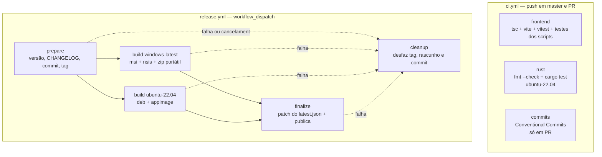
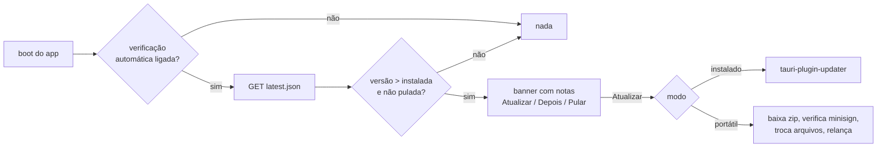

# Release e distribuição — Design

**Spec**: `.specs/features/release-distribution/spec.md`
**Status**: Draft

---

## Visão da arquitetura

Dois arquivos de workflow, quatro scripts Node e três módulos novos no app. A separação entre eles é o que faz a regra "push nunca publica" ser **estrutural**: o arquivo que valida não sabe criar release, e o arquivo que publica não tem gatilho automático.



O fluxo do app é o espelho disso: o pipeline produz um `latest.json` com uma entrada por formato, e o app escolhe a entrada pelo **modo** em que está rodando.



---

## Reuso de código

### O que vem do `local-mind` (adaptado, não copiado)

| Origem | Como é usado aqui | O que **muda** |
|---|---|---|
| `.github/workflows/ci.yml` | Estrutura de 3 jobs (frontend / rust / commits), `concurrency` com cancelamento, validador de Conventional Commits em shell | Sai `protoc` (não há `lancedb`); entra `npm run test` e `cargo fmt --all -- --check` |
| `.github/workflows/release.yml` | Os 4 jobs (`prepare` → `build` matriz → `finalize` → `cleanup`) e as guardas de branch/tag | Sai o `NO_STRIP: "true"` — ele existe lá por causa de 256MB de binários de terceiros no AppDir, que o SwarmDeck não tem. Sai a conferência do `.deb`, que checava `llama-server` |
| `scripts/bump-version.mjs` | Escritor único da versão, com `--dry-run` e `--base` | **Escreve o `Cargo.toml` da raiz** (`[workspace.package]`), não o de `src-tauri` — aqui a versão é herdada por `version.workspace = true` |
| `scripts/make-portable.mjs` | Montagem do zip portátil com marcador e README | `APP_NAME` = `SwarmDeck`; o executável compilado chama-se `swarmdeck.exe` enquanto o `productName` é `SwarmDeck` — o script precisa lidar com essa diferença ou o `mainBinaryName` precisa ser fixado (ver Decisões) |
| `scripts/patch-latest-json.mjs` | Injeta a entrada `windows-x86_64-portable` e reescreve a URL de rascunho para a URL de tag | Sem mudança relevante |
| `cliff.toml` | Configuração do git-cliff | Grupos de commit em português, para bater com o idioma do repositório |

O `local-mind` é um repositório do próprio usuário e serve como **fonte de padrão**, não como dependência: nada aqui faz `fetch` de lá em tempo de execução.

### O que já existe no SwarmDeck

| Componente | Local | Como entra |
|---|---|---|
| `Db::open(path)` | `src-tauri/src/db/mod.rs` | Passa a receber o caminho vindo do módulo `paths`, em vez de um caminho montado no ponto de chamada |
| `package.json` scripts | raiz | Ganha `test:scripts` (`node --test scripts/`) |
| `Cargo.toml` da raiz | raiz | Ganha `[profile.release]` com `strip` e `lto` (REL-35) |

---

## Componentes

### 1. `ci.yml` — validação

- **Propósito**: reprovar código quebrado antes de qualquer release existir. Não cria tag, release nem artefato.
- **Local**: `.github/workflows/ci.yml`
- **Gatilhos**: `push` em `master`, `pull_request`
- **Concorrência**: `group: ci-${{ github.ref }}`, `cancel-in-progress: true`
- **Jobs**:
  - `frontend` (`ubuntu-latest`, Node 24, cache npm): `npm ci` → `npm run build` → `npm run test` → `npm run test:scripts`
  - `rust` (`ubuntu-22.04`): dependências de sistema → `dtolnay/rust-toolchain@stable` → `Swatinem/rust-cache@v2` com `workspaces: src-tauri` → `cargo fmt --all -- --check` → `cargo test`
  - `commits` (só em `pull_request`): valida `origin/${{ github.base_ref }}..HEAD` contra o padrão de Conventional Commits, ignorando commits de merge
- **Requisitos**: REL-27, REL-28, REL-29, REL-30, REL-31

**Dependências de sistema no Linux** (sem `protoc`, com toolchain C por causa do `rusqlite` `bundled`):
`libwebkit2gtk-4.1-dev`, `libgtk-3-dev`, `libayatana-appindicator3-dev`, `librsvg2-dev`, `libxdo-dev`, `libssl-dev`, `build-essential`, `file`, `patchelf`, `wget`, `curl` — mais `libfuse2` **apenas** no job de release, que é quem gera o AppImage.

### 2. `release.yml` — publicação

- **Propósito**: transformar um clique em release completa.
- **Local**: `.github/workflows/release.yml`
- **Gatilho**: `workflow_dispatch` com input `bump` (choice: `patch`/`minor`/`major`). **Nenhum outro.**
- **Permissões**: `contents: write`
- **Concorrência**: `group: release`, `cancel-in-progress: false` — cancelar uma release no meio é pior que enfileirar
- **Jobs**:

| Job | Runner | Faz | Requisitos |
|---|---|---|---|
| `prepare` | ubuntu-latest | Guarda de branch → calcula versão → guarda de tag → `bump-version.mjs` → `cargo metadata` (atualiza o `Cargo.lock` sem compilar) → git-cliff (CHANGELOG + notas) → commit `chore(release): vX.Y.Z` + tag + push | REL-01..REL-07 |
| `build` | matriz `windows-latest` / `ubuntu-22.04`, `fail-fast: false` | Checkout **na tag** → deps → `npm ci` → `tauri-apps/tauri-action@v0` com `releaseDraft: true` → no Windows, monta e assina o zip portátil e o anexa | REL-09..REL-15 |
| `finalize` | ubuntu-latest | Baixa `latest.json`, injeta a entrada portátil com a URL de tag, reenvia, e tira a release do rascunho | REL-11, REL-15 |
| `cleanup` | ubuntu-latest | `if: always() && prepare == success && (build != success \|\| finalize != success)` — apaga rascunho e tag, e reverte o commit de versão | REL-08 |

**Saídas do `prepare`**: `version`, `tag`, `notes`, `release_sha` (o último existe só para o `cleanup` reverter exatamente aquele commit).

### 3. `scripts/bump-version.mjs`

- **Propósito**: escritor **único** da versão. O workflow nunca edita esses arquivos à mão.
- **Local**: `scripts/bump-version.mjs`
- **Interfaces**:
  - `parseVersion(raw): {major, minor, patch}`
  - `bumpVersion(current, kind): string`
  - `setJsonVersion(source, version): string` — cobre `package.json` e o `packages[""].version` do `package-lock.json`
  - `setWorkspaceVersion(source, version): string` — reescreve `version` **dentro de `[workspace.package]`** do `Cargo.toml` da raiz; um replace global pegaria versões de dependência
  - CLI: `node scripts/bump-version.mjs <patch|minor|major|X.Y.Z> [--base X.Y.Z] [--dry-run]`, imprimindo **só** a versão resultante em stdout
- **Arquivos que escreve**: `package.json`, `package-lock.json`, `Cargo.toml` (raiz). O `Cargo.lock` é atualizado pelo `cargo metadata` no workflow; o `src-tauri/tauri.conf.json` deriva de `"../package.json"` e não é tocado
- **Requisitos**: REL-03, REL-04

### 4. `scripts/make-portable.mjs`

- **Propósito**: montar o zip portátil de Windows.
- **Local**: `scripts/make-portable.mjs`
- **Interfaces**: `portableArchiveName(version, arch)`, `portableReadme(version)`, CLI `--version X.Y.Z [--binary <path>] [--out <dir>]`
- **Conteúdo do zip**: executável, `WebView2Loader.dll` (se o bundle o produzir), recursos declarados em `bundle.resources`, o marcador `.portable` e um `LEIA-ME.txt`
- **Compressão**: `Compress-Archive` do PowerShell — já vem no runner, sem ferramenta extra
- **Requisitos**: REL-14, REL-18

### 5. `scripts/patch-latest-json.mjs`

- **Propósito**: acrescentar ao manifesto a entrada que o `tauri-action` não conhece.
- **Local**: `scripts/patch-latest-json.mjs`
- **Interfaces**: `pickAssetUrlByName(assets, name)`, `withReleaseTag(url, tag)`, `patchManifest({manifest, key, url, signature})`
- **Por que existe**: o zip é anexado enquanto a release ainda é rascunho, e rascunho não tem ref de tag — a URL do asset aponta para um caminho `untagged-<hash>` que morre quando a release é publicada. A URL precisa ser reescrita para a forma `download/<tag>/<arquivo>`
- **Chave usada**: `windows-x86_64-portable`. `platforms` é um mapa; uma chave que o plugin oficial não conhece é inerte para ele e legível pelo nosso código
- **Requisitos**: REL-11, REL-15

### 6. `src-tauri/src/paths.rs` — resolução de caminhos

- **Propósito**: ser a **única** autoridade sobre onde os dados do app moram.
- **Local**: `src-tauri/src/paths.rs`
- **Interfaces**:
  - `enum Flavor { Installed, Portable }`
  - `fn flavor(exe_dir: &Path) -> Flavor` — `Portable` quando existe o marcador `.portable` ao lado do executável
  - `fn data_dir(app: &AppHandle) -> Result<PathBuf, PathError>` — `<exe_dir>/data` no portátil, `app_data_dir()` no instalado
  - `fn db_path(app: &AppHandle) -> Result<PathBuf, PathError>` — `data_dir()/swarmdeck.sqlite`
  - `fn is_writable(dir: &Path) -> bool` — usado pelo update portátil antes de baixar qualquer coisa
- **Dependências**: `tauri::AppHandle`, `std::env::current_exe`
- **Reusa**: quem consome é o `Db::open` já existente
- **Requisitos**: REL-16, REL-17, REL-18

### 7. `src-tauri/src/update/` — verificação e aplicação

- **Local**: `src-tauri/src/update/{mod.rs, check.rs, portable.rs}`
- **Interfaces**:
  - `async fn check(app) -> Result<Option<UpdateInfo>, UpdateError>` — silenciosa; erro de rede vira `Ok(None)` + log
  - `struct UpdateInfo { version, notes, flavor, download_url, signature }`
  - `async fn apply_installed(app, info, on_progress)` — delega ao `tauri-plugin-updater`
  - `async fn apply_portable(app, info, on_progress)` — baixa para temporário, valida minisign contra a chave pública da config, extrai, renomeia o executável atual para `.old`, troca os arquivos, relança
  - `fn cleanup_stale_old(exe_dir)` — apaga `.old` remanescente no boot
  - `fn skipped_versions()` / `fn skip(version)` — persistidas na mesma configuração do app
- **Verificação de assinatura**: `minisign-verify` — o mesmo esquema (Ed25519/minisign) que o `tauri-plugin-updater` usa internamente, o que permite **uma chave só** para os dois caminhos
- **Requisitos**: REL-19 a REL-25

### 8. Superfície de UI

- **Local**: `src/components/UpdateBanner.tsx` e uma seção "Atualizações" na tela de configurações
- **Observação de escopo**: **o SwarmDeck ainda não tem tela de configurações.** A tarefa que entrega REL-32..REL-34 cria a superfície mínima — não uma tela de settings completa, que pertence a outra feature. Se, quando esta feature for executada, o M3 já tiver criado a tela, a seção entra nela.
- **Requisitos**: REL-20, REL-23, REL-26, REL-32, REL-33, REL-34

### 9. Configuração do Tauri

`src-tauri/tauri.conf.json` passa a declarar:

```jsonc
{
  "version": "../package.json",
  "bundle": {
    "targets": ["msi", "nsis", "deb", "appimage"],
    "createUpdaterArtifacts": true,
    "windows": { "nsis": { "installMode": "currentUser" } }
  },
  "plugins": {
    "updater": {
      "endpoints": ["https://github.com/rafaelsene01/swarmdeck/releases/latest/download/latest.json"],
      "pubkey": "<chave pública gerada por `tauri signer generate`>"
    }
  }
}
```

E `src-tauri/capabilities/default.json` passa a existir, com `core:default` e as permissões do updater — hoje **não há nenhuma capability declarada** no projeto.

---

## Modelo de dados

O manifesto publicado (`latest.json`), depois do patch:

```jsonc
{
  "version": "0.1.1",
  "notes": "…",
  "pub_date": "2026-07-28T12:00:00Z",
  "platforms": {
    "windows-x86_64": { "signature": "…", "url": "…-setup.exe" },
    "windows-x86_64-nsis": { "signature": "…", "url": "…-setup.exe" },
    "windows-x86_64-msi": { "signature": "…", "url": "….msi" },
    "linux-x86_64": { "signature": "…", "url": "….AppImage" },
    "windows-x86_64-portable": { "signature": "…", "url": "…_x64-portable.zip" }
  }
}
```

A última chave é a única escrita por código nosso; as demais vêm do `tauri-action`.

Configuração persistida do app (acrescentada ao que já existir):

```jsonc
{
  "updates": {
    "autoCheck": true,
    "skippedVersions": ["0.1.3"]
  }
}
```

---

## Tratamento de erro

| Cenário | Tratamento | O que o usuário vê |
|---|---|---|
| Disparo fora de `master` | `prepare` falha no primeiro step, antes do checkout | Run vermelho com a razão |
| Tag já existe (local ou remota) | `prepare` falha antes de escrever arquivo | Run vermelho, repositório intacto |
| Um job da matriz falha | `fail-fast: false` deixa o outro terminar; release fica em rascunho; `cleanup` desfaz tag e commit | Nenhuma release publicada; o número volta a ficar livre |
| `git revert` do commit de versão não aplica | Job falha com mensagem pedindo reversão manual | Aviso explícito no log; **nunca** `push --force` |
| Secret de assinatura ausente | `tauri-action` falha ao assinar; sem `.sig`, sem release | Run vermelho |
| Sem rede no boot | `check()` devolve `Ok(None)` e registra log | Nada |
| Sem rede no "Verificar agora" | Erro propagado à UI | Mensagem de erro |
| Pasta do portátil somente-leitura | `is_writable` reprova **antes** do download | "Não é possível atualizar a partir desta pasta" |
| Assinatura inválida | Aborta antes de tocar em qualquer arquivo | "A atualização foi descartada por falha de verificação" |
| Troca de arquivos falha no meio | Restaura o `.old` | App continua utilizável na versão antiga |
| `latest.json` sem entrada para o modo atual | Tratado como "sem atualização" | Nada |

---

## Decisões técnicas

| Decisão | Escolha | Razão |
|---|---|---|
| Onde a versão do Rust é escrita | `Cargo.toml` **da raiz**, em `[workspace.package]` | `src-tauri/Cargo.toml` usa `version.workspace = true`. Copiar o script do local-mind sem adaptar produziria uma versão que nunca muda — e o erro seria silencioso |
| Versão no `tauri.conf.json` | `"../package.json"` | Elimina uma cópia. Um caminho inválido aqui falha o build com mensagem clara, então o modo de falha é barulhento |
| Nome do executável | Fixar `mainBinaryName: "SwarmDeck"` | Hoje o binário sai `swarmdeck.exe` (nome do pacote Cargo) e o `productName` é `SwarmDeck`. O zip portátil ficaria com um nome e a documentação com outro |
| Base do build de Linux | `ubuntu-22.04` | Compilar em base mais nova eleva o glibc mínimo e quebra `.deb`/`.AppImage` em máquina mais antiga. Vale para o CI também, para o CI medir o mesmo alvo do release |
| `protoc` no runner | **Não** | Existe no local-mind por causa do `lance-encoding`/`lancedb`. O SwarmDeck não tem essa dependência. Incluir seria carga cultuada |
| `NO_STRIP` no AppImage | **Não** | Existe no local-mind porque o AppDir carrega ~256MB de binários de terceiros que o `linuxdeploy` tenta stripar. O SwarmDeck não vendoriza binário nenhum — **até o sidecar MCP existir**. Quando existir, este item volta à mesa |
| Release em rascunho até o fim | `releaseDraft: true` + `finalize` | Uma release publicada pela metade é pior que nenhuma: já foi baixada por alguém |
| Desfazer com `revert`, nunca `--force` | `git revert` no `cleanup` | `master` é branch publicada; reescrevê-la quebra todo clone. Um commit de revert é feio e seguro |
| Chave única para instaladores e portátil | `tauri signer sign` no zip | Um só ponto de confiança; o app valida os dois caminhos com a mesma chave pública |
| Verificação automática ligada por padrão | Ligada, com opt-out | É a única chamada de rede do app; deixá-la desligada por padrão faria ninguém receber correção |
| `clippy -D warnings` fora do MVP | P3, atrás de limpeza | `fmt --check` foi medido e passa hoje; clippy **não** foi medido. Ligar sem medir transformaria "introduzir CI" numa refatoração |

---

## Perguntas em aberto

1. **Chave de assinatura** — `tauri signer generate` precisa ser rodado pelo mantenedor e os secrets `TAURI_SIGNING_PRIVATE_KEY` / `TAURI_SIGNING_PRIVATE_KEY_PASSWORD` cadastrados no repositório. É um passo humano; nenhuma tarefa automatizada substitui.
2. **Versões exatas de `tauri-plugin-updater` e `minisign-verify`** — os fatos sobre elas nesta spec vêm da pesquisa registrada em `local-mind/.specs/features/release-distribution/spec.md` (julho/2026). A tarefa que adiciona a dependência **reconfirma** a versão corrente antes de fixá-la.
3. **Onde a configuração do app é persistida** — o SwarmDeck ainda não tem arquivo de config; hoje só existe o SQLite. `updates.autoCheck` e `skippedVersions` podem morar numa tabela `settings` do próprio banco, o que evita inventar um segundo formato. Decidir na tarefa que os introduz.
4. **Sidecar MCP** — quando `crates/swarmdeck-mcp` existir, o bundle precisa declará-lo como `externalBin` e o zip portátil precisa levá-lo. Registrado como Todo no `STATE.md`.
