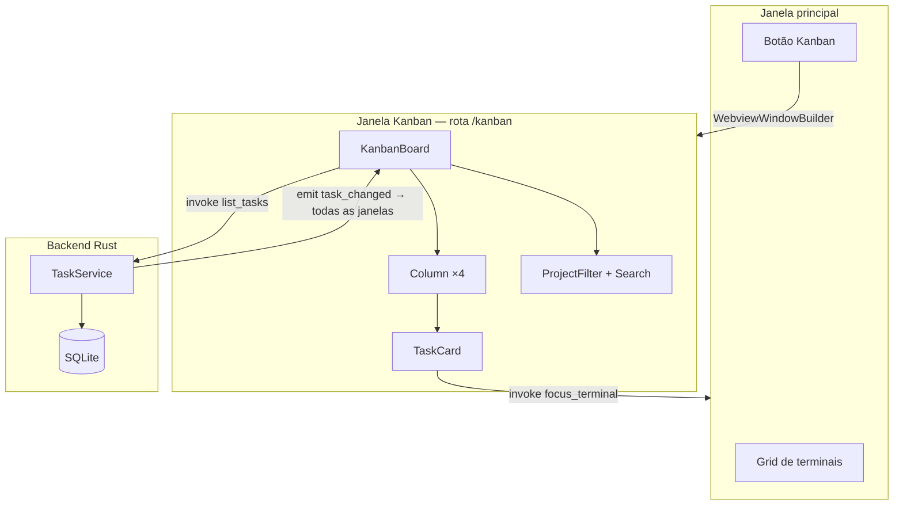

# Kanban de tarefas — Design

**Spec**: `.specs/features/task-kanban/spec.md`
**Status**: Draft
**Depende de**: `.specs/features/mcp-task-server/design.md` (esquema de dados, `TaskService`, evento `task_changed`)

---

## Arquitetura

O Kanban é uma **segunda janela** do mesmo processo Tauri, apontando para uma rota separada do mesmo bundle do front. Não é um app separado nem um painel embutido.



**Sincronização:** o board carrega o estado uma vez no mount e depois só reage ao evento `task_changed`. **Sem polling.** O evento carrega a tarefa afetada e a operação, então o board aplica a mudança localmente em vez de recarregar tudo — é o que entrega o "< 1s" de KAN-02 mesmo com o board cheio.

---

## Reuso

| Componente | Origem | Como usar |
|---|---|---|
| `TaskService` | `mcp-task-server/design.md` | **Mesmo serviço** usado pelo MCP. Criação manual (KAN-07) passa pelas mesmas regras que a criação por agente — inclusive a máquina de estados. |
| Evento `task_changed` | `mcp-task-server/design.md` | Já é emitido para todas as janelas; o board só assina |
| `WebviewWindowBuilder` | Tauri 2 | Janela secundária apontando para `/kanban` |
| `TerminalManager` | `multi-terminal/design.md` | Resolver terminal vivo para a ação enviar-ao-terminal |
| Cores de projeto | `projects/spec.md` | Chip do card reusa a cor já atribuída ao projeto |

### Pontos de integração

| Sistema | Integração |
|---|---|
| Servidor MCP | Toda mudança feita por agente chega como `task_changed` |
| Terminais | Enviar-ao-terminal escreve no PTY e foca a janela principal |
| Projetos | Filtro e chip coloridos vêm da tabela `projects` |

---

## Componentes

### `KanbanWindow` (Rust)
- **Propósito**: criar e gerenciar o ciclo de vida da janela do board.
- **Local**: `src-tauri/src/windows/kanban.rs`
- **Interfaces**:
  - `open(app: &AppHandle) -> Result<()>` — cria ou foca se já existe
  - `close_with_main()` — fecha junto com a principal (KAN-08)
- **Nota**: reabrir deve **focar** a janela existente, nunca criar uma segunda.

### `KanbanBoard` (React)
- **Propósito**: raiz do board; possui o estado das tarefas e a assinatura do evento.
- **Local**: `src/routes/kanban/KanbanBoard.tsx`
- **Interfaces**: `<KanbanBoard />`
- **Estado**: `Map<TaskId, Task>` normalizado; as colunas derivam por seleção
- **Reusa**: `listen('task_changed')` do Tauri

### `Column` (React)
- **Propósito**: uma fase, com contagem, ordenação e rolagem própria.
- **Local**: `src/routes/kanban/Column.tsx`
- **Interfaces**: `<Column status={TaskStatus} tasks={Task[]} sort={SortMode} />`
- **Nota**: rolagem **independente por coluna** (borda da spec) — o container do board não rola verticalmente.

### `TaskCard` (React)
- **Propósito**: representação compacta de uma tarefa.
- **Local**: `src/routes/kanban/TaskCard.tsx`
- **Interfaces**: `<TaskCard task={Task} onOpen onDelete onSend />`
- **Nota**: título limitado a 3 linhas com truncamento; descrição truncada; ambos com texto completo no detalhe.

### `SendToTerminal` (Rust)
- **Propósito**: levar o contexto de uma tarefa ao terminal de origem.
- **Local**: `src-tauri/src/tasks/send.rs`
- **Interfaces**:
  - `send(task_id) -> Result<()>` — resolve o terminal, escreve no PTY, foca a janela principal
- **Comportamento**: se o terminal de origem não existe mais, a ação vem **desabilitada** do backend (KAN-04 / borda), em vez de falhar no clique.

---

## Modelos de dados

Sem tabelas novas — o board lê o esquema definido em `mcp-task-server/design.md`. O que se define aqui é o **contrato de evento**:

```typescript
type TaskStatus = 'pending' | 'in_progress' | 'in_testing' | 'completed'

interface Task {
  id: number                    // exibido como "#2"
  title: string
  description: string | null
  plan: string | null
  implementation: string | null
  status: TaskStatus
  project: { id: string, name: string, color: string } | null
  terminalId: string | null
  terminalAlive: boolean        // calculado — controla a ação enviar-ao-terminal
  createdAt: number
  updatedAt: number
}

interface TaskChangedEvent {
  op: 'created' | 'updated' | 'moved' | 'deleted'
  task: Task | null             // null quando op = 'deleted'
  taskId: number
  previousStatus: TaskStatus | null   // presente quando op = 'moved'
}
```

`terminalAlive` é derivado no backend, não persistido — é o que impede a UI de oferecer uma ação que vai falhar.

---

## Tratamento de erros

| Cenário | Tratamento | O que o usuário vê |
|---|---|---|
| Tarefa excluída com o detalhe aberto | Evento `deleted` fecha o detalhe | Aviso "esta tarefa foi removida" |
| Terminal de origem morto | `terminalAlive: false` | Ação enviar desabilitada, com explicação no hover |
| Duas transições concorrentes | Última válida vence; evento reconcilia | Card converge; nunca duplica |
| Projeto excluído | `project: null` via `ON DELETE SET NULL` | Card sem chip, marcado sem projeto |
| Evento chega para tarefa desconhecida | Board busca aquela tarefa pontualmente | Nada |
| Board abre sem tarefas | 4 colunas com estados vazios distintos | Nunca uma tela em branco (borda da spec) |
| Janela principal fecha | Kanban fecha junto | — |

---

## Decisões técnicas

| Decisão | Escolha | Razão |
|---|---|---|
| Janela separada vs painel | **Janela Tauri secundária** | Comportamento do original, e resolve o caso real de dois monitores. Mesmo processo — compartilha `AppState` e eventos de graça. |
| Sincronização | Evento com delta, sem polling | Polling desperdiça e não entrega o "< 1s" percebido. O evento traz a tarefa afetada, então o board não recarrega tudo. |
| Forma do estado | `Map` normalizado, colunas derivadas | Um card muda de coluna alterando um campo — sem mover entre arrays nem risco de duplicata durante transição concorrente |
| Criação manual | Passa pelo **mesmo** `TaskService` | Se a UI tivesse caminho próprio, a regra do fluxo de teste teria duas implementações e uma delas ficaria para trás |
| Arrastar cards entre colunas | **Fora do v1** | Não observado no original, e conflita com a máquina de estados: arrastar de In Progress para Completed pularia a fase de teste. Deliberado. |
| Rolagem | Por coluna | Board com uma coluna cheia e outras vazias fica inutilizável se o container inteiro rolar |

---

## Riscos

- **Volume**: o critério de sucesso fala em 200 tarefas sem travar. Com estado normalizado e atualização por delta isso é folgado, mas se o board crescer muito além disso, as colunas precisarão de virtualização.
- **Ordem das colunas é fixa** e amarrada à máquina de estados. Se algum dia o catálogo de fases virar configurável, este design não acomoda — seria uma reescrita, não um ajuste.
