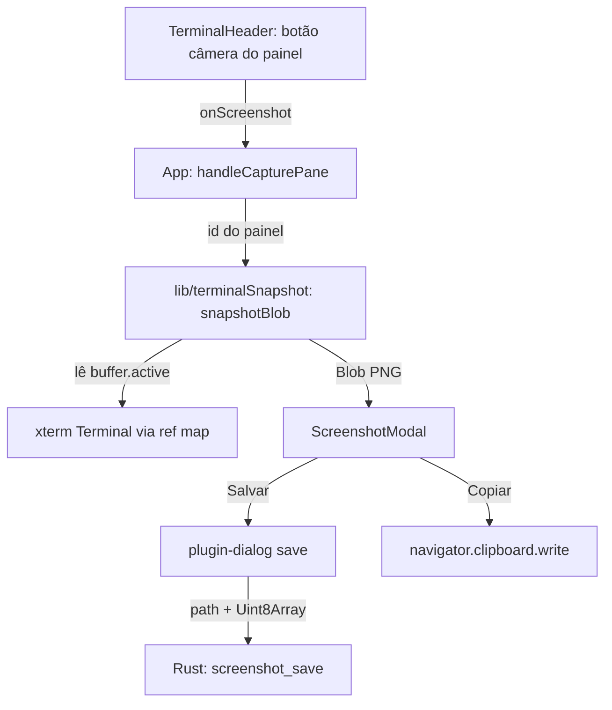

# terminal-screenshot Design

**Spec**: `.specs/features/terminal-screenshot/spec.md`
**Status**: Draft

> **Revisão de 18/08/2026 (AD-018).** O botão de câmera saiu do header do app e
> entrou na barra de título de cada painel. Com isso o modo armado inteiro —
> `captureArmed`, `data-capture-target`, faixa de dica, Esc e `onClickCapture`
> — foi removido do código. As seções abaixo marcadas *REVOGADO* descrevem o
> desenho anterior e ficam só pelo histórico do "por quê".

---

## Architecture Overview

Três camadas, nenhuma dependência nova. O front repinta o buffer do xterm num
`<canvas>` e entrega um `Blob`; o modal consome esse `Blob`; só a gravação em
disco desce para o Rust.



O `Terminal` do xterm vive dentro do efeito de `TerminalPane` e hoje não sai de
lá. A ponte é uma prop nova `onTerminal`, no mesmo formato do `onSessionId` que
já existe: o painel avisa quem o montou, `App.tsx` guarda num `useRef<Map>`.

---

## Code Reuse Analysis

### Existing Components to Leverage

| Component | Location | How to Use |
| --- | --- | --- |
| Padrão de callback de saída | `src/components/terminal/TerminalPane.tsx` (`onSessionId`) | Copiar a forma para `onTerminal` — prop opcional chamada no efeito e limpa no cleanup. |
| Overlay de Configurações | `src/App.tsx` (`.app-settings-backdrop`, `.app-settings-modal`) | O modal do print reusa o mesmo tratamento visual (SHOT-14) e o mesmo guard de clique no backdrop. |
| Barra de ações do painel | `src/components/terminal/TerminalHeader.tsx` (`.terminal-header__actions`) | A câmera entra como mais um botão de ícone ao lado de maximizar/minimizar/clonar (SHOT-01). |
| Seletor nativo de arquivo | `@tauri-apps/plugin-dialog` (já instalado, `dialog:default` já na capability) | `save()` para escolher onde gravar (SHOT-16). |
| Módulo de comandos Rust | `src-tauri/src/commands/` + `invoke_handler` em `src-tauri/src/lib.rs` | `screenshot_save` entra como mais um comando, sem plugin novo. |
| Tokens de cor | `src/styles.css` (`--accent`, `--surface`, `--surface-2`, `--border`) | O modal usa só os tokens existentes. |

### Integration Points

| System | Integration Method |
| --- | --- |
| xterm.js | API pública de buffer: `terminal.buffer.active`, `IBufferLine.getCell`, `IBufferCell.getFgColor/getBgColor/isBold/isItalic/isDim/isUnderline/isInverse`. |
| Tauri IPC | `invoke('screenshot_save', { path, bytes })` com `bytes: Uint8Array` (bytes crus, não array JSON). |
| WebView (Chromium/WebKitGTK) | `canvas.toBlob('image/png')`, `navigator.clipboard.write` com `ClipboardItem`. |

---

## Components

### terminalSnapshot

- **Purpose**: converter o viewport de uma instância do xterm num PNG.
- **Location**: `src/lib/terminalSnapshot.ts`
- **Interfaces**:
  - `paintSnapshot(term: Terminal, opts: SnapshotOptions, ctx: CanvasRenderingContext2D): void` — função pura de desenho; recebe o contexto pronto, não cria canvas. É o que os testes exercitam com um contexto falso.
  - `snapshotBlob(term: Terminal, meta: { index: number; cwd: string }): Promise<Blob>` — mede a célula no DOM, cria o canvas, chama `paintSnapshot`, devolve `toBlob('image/png')`.
  - `SnapshotOptions = { cellWidth, cellHeight, fontFamily, fontSize, dpr, title, padding }`
- **Dependencies**: tipos de `@xterm/xterm` apenas.
- **Reuses**: nada — módulo novo, isolado de propósito para ser testável sem DOM.

**Como resolve a cor de uma célula.** `isFgDefault()` cai no `foreground` do
tema (`#e8e8ea`); `isFgRGB()` desmonta o inteiro em `r,g,b`; `isFgPalette()`
indexa a tabela ANSI. A tabela tem as 16 cores padrão do xterm (paleta Tango)
escritas à mão e os índices 16-231 (cubo 6x6x6) e 232-255 (escala de cinza)
calculados — 240 cores em ~10 linhas em vez de 240 literais. `isInverse()`
troca frente e fundo depois de resolvidas (SHOT-12).

**Como mede a célula.** `term.element.querySelector('.xterm-screen')`:
`clientWidth / term.cols` e `clientHeight / term.rows`. Se qualquer dos dois der
zero (painel de aba inativa), `snapshotBlob` rejeita e o clique não abre modal
(SHOT-13 e a edge case de zero linhas/colunas).

### ScreenshotModal

- **Purpose**: mostrar o PNG e oferecer salvar, copiar e fechar.
- **Location**: `src/components/terminal/ScreenshotModal.tsx`
- **Interfaces**:
  - `props: { blob: Blob; fileName: string; onClose: () => void }`
- **Dependencies**: `@tauri-apps/plugin-dialog` (`save`), `@tauri-apps/api/core` (`invoke`), `lucide-react` (`X`, `Download`, `Copy`).
- **Reuses**: classes de overlay do `App.tsx`; `NewTerminalDialog` como referência de forma de diálogo apresentacional.

Estado interno: `error: string | null`. Toda ação é `try/catch`; sucesso chama
`onClose()`, falha preenche `error` e o modal permanece (SHOT-19, SHOT-20,
SHOT-21). `URL.createObjectURL` no mount, `revokeObjectURL` no unmount.

### TerminalHeader (modificado) — AD-018

- **Purpose**: disparar a captura do painel a que ele pertence.
- **Location**: `src/components/terminal/TerminalHeader.tsx`
- **Interfaces**: prop nova `onScreenshot?: (button: HTMLButtonElement) => void`.
- **Reuses**: `.terminal-header__actions` e o mesmo formato dos outros botões de ícone.

O botão devolve o próprio `event.currentTarget` porque agora existe uma câmera
por painel: é assim que `App.tsx` sabe a quem devolver o foco ao fechar o modal
(SHOT-23), sem manter um mapa de refs.

### App (modificado)

- **Purpose**: dono do print pendente e da ponte para as instâncias do xterm.
- **Location**: `src/App.tsx`
- **Interfaces**: estado `capture: { blob: Blob; fileName: string } | null`, ref `terminalsRef: MutableRefObject<Map<string, Terminal>>`, ref `cameraRef` com o botão que originou o print.
- **Reuses**: `renderTab` já monta cada `TerminalHeader` — só passa mais uma prop.

### ~~Header (modificado)~~ — REVOGADO por AD-018

Era o dono do botão de câmera e do par `captureArmed`/`onToggleCapture`. O
header do app não tem mais nada de captura.

### screenshot (Rust)

- **Purpose**: gravar os bytes do PNG no caminho escolhido.
- **Location**: `src-tauri/src/commands/screenshot.rs`
- **Interfaces**: `#[tauri::command] fn screenshot_save(path: String, bytes: Vec<u8>) -> Result<(), String>`
- **Dependencies**: `std::fs` apenas.
- **Reuses**: forma dos comandos existentes em `src-tauri/src/commands/`; registro no `invoke_handler` de `src-tauri/src/lib.rs`.

---

## Data Models

Nenhum modelo persistido. O único dado novo é efêmero e vive em memória:

```ts
type Capture = { blob: Blob; fileName: string }
```

Nada vai para o SQLite: um print não é estado de sessão.

---

## Risks & Concerns

| Concern | Where | Mitigation |
| --- | --- | --- |
| Fidelidade da repintura — ligaduras, CJK de largura dupla, emoji, sublinhado e cursor não vêm de graça | `src/lib/terminalSnapshot.ts` | `getWidth()` da célula trata largura dupla (célula de largura 0 é pulada); cursor e seleção ficam fora do print de propósito e estão no Out of Scope; fonte monoespaçada do próprio `term.options.fontFamily` mantém o alinhamento. |
| `App.tsx` já tem ~1100 linhas e concentra todo o estado da shell | `src/App.tsx` | O trabalho pesado (pintura) sai para `src/lib/terminalSnapshot.ts` e a UI para `ScreenshotModal.tsx`; em `App.tsx` entram só dois estados e dois refs. |
| Vazamento de estado armado entre abas | `src/App.tsx` (`renderTab`) | `data-capture-target` é decidido dentro de `renderTab` comparando `tab.id === activeTab.id`; painel de aba inativa nunca recebe a marca (SHOT-03). |
| `navigator.clipboard.write` pode falhar no WebKitGTK | `ScreenshotModal.tsx` | Erro visível no modal em vez de fechar em falso sucesso; se o build Linux falhar de fato, `tauri-plugin-clipboard-manager` entra numa AD nova. |
| `screenshot_save` é uma primitiva de escrita arbitrária exposta à webview | `src-tauri/src/commands/screenshot.rs` | O caminho vem sempre do seletor nativo do SO; e o app já roda terminais arbitrários, então a superfície nova é estritamente menor que a existente. Sem escopo de path configurável — seria teatro. |
| PNG de alguns MB atravessando o IPC | `ScreenshotModal.tsx` | `Uint8Array` no `invoke`, nunca `Array.from(bytes)`. |
| `jsdom` não implementa `canvas.toBlob` nem `ClipboardItem` | testes de `terminalSnapshot` e `ScreenshotModal` | `paintSnapshot` é testado com um contexto 2D falso (sem canvas real); `snapshotBlob`, `clipboard` e `invoke` são mockados nos testes de componente, como `QuotaIndicator.test.tsx` já faz com `invoke`. |
| Teste existente lista `camera` entre os botões inertes | `src/components/shell/Header.test.tsx:19` | A task do `Header` atualiza `INERT_LABELS` no mesmo commit; deixar para depois quebraria a suíte. |

---

## Decision Record

Esta feature adiciona **AD-015** a `.specs/STATE.md`: captura por repintura do
buffer do xterm, e não por fotografia do DOM (`html-to-image`/`html2canvas`) nem
da janela do SO (`xcap`). Escopo: qualquer captura de imagem futura de conteúdo
de terminal. Trade-off: fidelidade passa a ser responsabilidade do nosso código
(cursor, seleção e ligaduras ficam de fora) em troca de zero dependência,
determinismo entre WebView2 e WebKitGTK, e testabilidade em jsdom.

Nenhuma AD ativa é contrariada. AD-003 (crate já no lock antes de virar direta)
não se aplica: nenhuma crate nova entra.

---

## Visual Specification

Todos os valores abaixo saem dos tokens já declarados em `src/styles.css`.
Nenhuma cor nova entra no projeto. Referências consultadas para o padrão de
"preview de captura": o overlay de resultado do CleanShot X e o preview do
Shottr (cartão flutuante escuro, imagem com respiro, ações no rodapé), mais a
prática corrente de overlay escuro com `backdrop-filter` para modais.

### ~~Botão de câmera armado (SHOT-01)~~ — REVOGADO por AD-018

O botão do painel não tem estado armado: é um botão de ícone comum da
`.terminal-header__actions`, `Camera size={13}` como os vizinhos. O que segue
descreve o botão antigo do header do app.

| Propriedade | Valor |
| --- | --- |
| `border` | `1px solid var(--accent)` |
| `background` | `rgba(245, 183, 0, 0.14)` |
| `color` | `var(--accent)` |
| `aria-pressed` | `true` |
| Transição | `background 120ms ease, border-color 120ms ease` |

Desarmado volta ao estilo herdado de `.shell-header button` (transparente, sem
borda). Desabilitado (`terminalCount === 0`) segue o
`.shell-header button:disabled` existente.

### ~~Painel alvo (SHOT-02)~~ — REVOGADO por AD-018

| Estado | Propriedade | Valor |
| --- | --- | --- |
| Marcado | `outline` | `2px dashed rgba(245, 183, 0, 0.5)` |
| Marcado | `outline-offset` | `-2px` |
| Marcado | `cursor` | `crosshair` |
| Hover | `outline` | `2px solid var(--accent)` |
| Hover | `box-shadow` | `0 0 0 4px rgba(245, 183, 0, 0.12)` |

`outline` em vez de `border` de propósito: `border` mudaria o box model e
deslocaria o conteúdo do painel ao armar o modo.

### ~~Faixa de dica (SHOT-04)~~ — REVOGADO por AD-018

Fica entre a barra de abas e `.app-grid-area`, no mesmo lugar de
`.app-cwd-warning` (dentro de `.app-grid-area` as abas são absolutas e cobririam
o aviso). Texto: `Selecione um terminal para capturar · Esc cancela`.
`background: rgba(245, 183, 0, 0.10)`, `color: var(--accent)`,
`border-bottom: 1px solid var(--border)`, `padding: 0.35rem 1rem`,
`font-size: 0.8rem`, `role="status"`.

### Modal (SHOT-14)

Backdrop idêntico ao de Configurações: `position: fixed`, `inset: 0`,
`z-index: 1200`, `background: rgba(0, 0, 0, 0.62)`,
`backdrop-filter: blur(4px)`, centralizado por flex.

Cartão: `background: var(--surface)`, `border: 1px solid var(--border)`,
`border-radius: 16px`, `box-shadow: 0 32px 80px rgba(0, 0, 0, 0.65)`,
`max-width: min(90vw, 1000px)`, `max-height: 85vh`, `padding: 16px`,
`display: flex; flex-direction: column; gap: 12px`.

Imagem: `max-width: 100%`, `max-height: 60vh`, `object-fit: contain`,
`border-radius: 10px`, `border: 1px solid var(--border)`,
`background: var(--surface-2)`.

| Controle | Estilo |
| --- | --- |
| Fechar (`X`, canto superior direito) | botão fantasma, `color: var(--muted)`, hover `color: var(--fg)`, `aria-label="fechar"` |
| Copiar | `border: 1px solid var(--border)`, fundo transparente, `color: var(--fg)`, ícone `Copy` |
| Salvar | `background: var(--accent)`, `color: #0d0d0f`, sem borda, ícone `Download` |
| Erro inline | `color: var(--danger)`, `font-size: 0.8rem`, acima do rodapé, `role="alert"` |

Rodapé alinhado à direita, `gap: 8px`. Foco inicial em "Copiar". Todo controle
mantém anel de foco visível — nada de `outline: none` sem substituto.

### Movimento

Uma transição só, de 120ms, em `background`/`border-color`/`opacity`. Sem
animação de entrada do modal: o app não tem nenhuma hoje, e introduzir uma
aqui criaria inconsistência com o overlay de Configurações.
