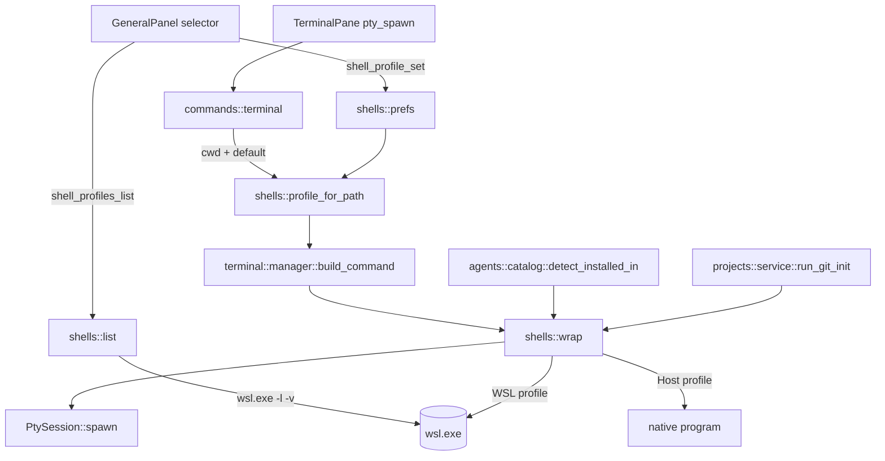

# WSL Terminal Profile Design

**Spec**: `.specs/features/wsl-terminal-profile/spec.md`
**Status**: Draft

---

## Architecture Overview

One new module, `src-tauri/src/shells/`, owns the answer to a single question: which machine does this process run on? Everything that spawns a process or probes for a binary asks that module for a `CommandBuilder` instead of building one itself. No other layer learns what WSL is.

The profile is never threaded through the frontend. `pty_spawn` already receives the `cwd`; the backend derives the profile from that `cwd` plus the stored preference. That keeps the IPC contract unchanged and removes a class of front/back disagreement.



---

## Code Reuse Analysis

### Existing Components to Leverage

| Component | Location | How to Use |
| --------- | -------- | ---------- |
| `build_command` | `src-tauri/src/terminal/manager.rs:38` | Already the single choke point for which program the PTY runs. Delegate its body to `shells::wrap`; do not add a second decision site. |
| `SessionConfig.shell` | `src-tauri/src/terminal/manager.rs:71` | The `Option<String>` field and its `pty_spawn` parameter already exist and are `None` at every call site. It is replaced by `profile`, not paralleled by it. |
| `resolve_command_in_path` | `src-tauri/src/agents/catalog.rs:187` | Host-side detection stays exactly as is. The WSL branch is a sibling function, not a rewrite — `editors.rs:187` also depends on this one and must not change. |
| `LaunchResolution` | `src-tauri/src/agents/launch.rs:29` | Already carries `command: Option<String>`, `args`, and `warning`. The WSL path only changes what fills `command` (an in-distro absolute path); shell-fallback and warning semantics are untouched (`AGT-04`). |
| `strip_verbatim_prefix` | `src-tauri/src/projects/service.rs:425` | Already converts `\\?\UNC\wsl.localhost\...` back to `\\wsl.localhost\...`, which is exactly the shape `profile_for_path` parses and `--cd` accepts. No path work is added. |
| `agent_prefs` single-row pattern | `src-tauri/src/db/migrations/004_agent_prefs.sql`, `src-tauri/src/agents/prefs.rs` | Copy the shape: `id INTEGER PRIMARY KEY CHECK (id = 1)`, no seed row, absence means never chosen. |
| `quota_prefs` settings pattern | `src/routes/settings/SettingsShell.tsx:249`, `src/routes/settings/GeneralPanel.tsx:223` | Copy the shape: presentational panel, parent invokes `*_get` on open and `*_set` on change. |
| `argv(&CommandBuilder)` test helper | `src-tauri/src/terminal/manager.rs:241` | Reuse for asserting the exact argv `wrap` produces, without opening a PTY. |
| `TERMINAL_ID_ENV` | `src-tauri/src/terminal/manager.rs:158` | Keeps naming the variable; on a WSL profile the value travels as an `env` argv entry rather than a process env var. |

### Integration Points

| System | Integration Method |
| ------ | ------------------ |
| `pty_spawn` IPC | Signature keeps `cwd`; the `shell: Option<String>` parameter is retired in favor of backend-side resolution. The frontend sends nothing new. |
| `agent_catalog` IPC | Reads the active profile before probing, so the `installed` flag reflects the distro the user picked. |
| SQLite | One new migration, `011_terminal_profile.sql`. `projects` is untouched. |
| `wsl.exe` | Called three ways only: `-l -v` to enumerate, `-d <distro> --cd <cwd>` to open a login shell, and `-d <distro> --cd <cwd> -- env ...` to run a program. |

---

## Components

### `shells::TerminalProfile` and path derivation

- **Purpose**: Name the execution target and derive it from a stored path.
- **Location**: `src-tauri/src/shells/mod.rs`
- **Interfaces**:
  - `enum TerminalProfile { Host, Wsl { distro: String } }` — the only representation of which machine.
  - `fn profile_for_path(cwd: &Path, default: &TerminalProfile) -> TerminalProfile` — returns `Wsl { distro }` when `cwd` starts with `\\wsl.localhost\<distro>\` or `\\wsl$\<distro>\`, otherwise clones `default` (`WSLP-07`, `WSLP-08`).
  - `fn id(&self) -> String` and `fn parse_id(&str) -> Option<TerminalProfile>` — the stored string form: `host` or `wsl:<distro>`. A string enum, so a future POSIX-shell profile needs no migration.
- **Dependencies**: `std::path` only. No process spawn, no database — this is the pure, fully testable core.
- **Reuses**: The path shape `strip_verbatim_prefix` already guarantees.

### `shells::list`

- **Purpose**: Enumerate selectable profiles.
- **Location**: `src-tauri/src/shells/list.rs`
- **Interfaces**:
  - `fn parse_distro_list(raw: &[u8]) -> Vec<DistroEntry>` — pure: decodes UTF-16LE, strips carriage returns, skips the header row, drops `docker-desktop` and `docker-desktop-data`, reads the `VERSION` column into `wsl1: bool` (`WSLP-17`, `WSLP-18`, `WSLP-20`).
  - `fn list_profiles() -> Vec<ProfileEntry>` — always returns `Host` first; appends one entry per distro. Returns `Host` alone on non-Windows targets and whenever `wsl.exe -l -v` is missing or exits non-zero (`WSLP-01`, `WSLP-16`, `WSLP-19`).
  - `struct ProfileEntry { id: String, label: String, wsl1: bool }` — `label` is what the selector renders.
- **Dependencies**: `std::process::Command` (not the PTY), `cfg(windows)`.
- **Reuses**: The `CREATE_NO_WINDOW` flag pattern from `src-tauri/src/editors.rs:199`, so enumeration never flashes a console.

### `shells::wrap`

- **Purpose**: Turn (profile, program, args, env, cwd) into the `CommandBuilder` that will actually run.
- **Location**: `src-tauri/src/shells/wrap.rs`
- **Interfaces**:
  - `fn wrap(profile: &TerminalProfile, program: Option<&str>, args: &[String], env: &[(String, String)], cwd: &Path) -> CommandBuilder`
  - `fn login_path(distro: &str) -> Option<String>` — one `wsl.exe -d <distro> -- bash -lc 'printenv PATH'`, cached per distro for the process lifetime (supports `WSLP-14`).
- **Dependencies**: `portable_pty::CommandBuilder`, `shells::mod`.
- **Reuses**: `CommandBuilder`, already the currency `PtySession::spawn` takes.

The four cases it produces, verified against `wsl.exe` on the reference machine:

| Profile | Program | Resulting argv |
| ------- | ------- | -------------- |
| `Host` | `None` | `new_default_prog()` — today's behavior, unchanged |
| `Host` | `Some(p)` | `p` plus `args` — today's behavior, unchanged |
| `Wsl{d}` | `None` | `wsl.exe -d <d> --cd <cwd>` with no trailing `--`, so the distro login shell runs (`WSLP-03`) |
| `Wsl{d}` | `Some(p)` | `wsl.exe -d <d> --cd <cwd> -- env PATH=<login> <K>=<V>... <p> <args...>` (`WSLP-04`, `WSLP-09`) |

`env` is the argv-only way to set variables: it needs no shell, so no `WSLENV`, no quoting, and no metacharacter that could be expanded or eaten (`WSLP-05`). This matters concretely — a `$var` inside `bash -lc '...'` was observed being consumed before `bash` saw it, so the design forbids shell strings on this path entirely.

### `shells::prefs`

- **Purpose**: Persist the default profile.
- **Location**: `src-tauri/src/shells/prefs.rs`
- **Interfaces**:
  - `fn default_profile(conn: &Connection) -> Result<Option<TerminalProfile>, DbError>` — `None` when there is no row or the column is `NULL`.
  - `fn set_default_profile(conn: &Connection, profile: &TerminalProfile) -> Result<(), DbError>`
  - `fn resolve_default(conn: &Connection) -> TerminalProfile` — the stored value if its distro is still listed; otherwise `Host` plus an unavailable marker for the UI (`WSLP-13`).
- **Dependencies**: `rusqlite`, `shells::list`.
- **Reuses**: `src-tauri/src/agents/prefs.rs` line for line, including the not-seeded semantics.

### `agents::catalog::detect_installed_in`

- **Purpose**: Report which agent CLIs exist on the profile the user picked.
- **Location**: `src-tauri/src/agents/catalog.rs` (modify)
- **Interfaces**:
  - `fn detect_installed_in(profile: &TerminalProfile) -> Vec<AgentStatus>` — `Host` delegates to today's `detect_installed()`; `Wsl` runs one `bash -lc 'type -P claude codex ...'` and matches results by basename.
  - `fn parse_type_p_output(raw: &str, catalog: &[AgentDescriptor]) -> Vec<(&'static str, String)>` — pure and testable: absolute paths in, `(agent id, path)` pairs out.
- **Dependencies**: `shells::wrap`.
- **Reuses**: `CATALOG` as the single source of which commands to probe; `AgentStatus` unchanged so `commands/agents.rs` and the frontend types stay put.

`bash -lc` is load-bearing, not incidental: on the reference machine `claude` resolves to `/home/<user>/.local/bin/claude`, which a non-login shell does not have on `PATH`. A probe without `-l` reports every CLI missing. `type -P` takes several names in one call, so the distro boots once (`WSLP-06`).

---

## Data Models

### `terminal_profile_prefs` (new table, migration `011_terminal_profile.sql`)

```sql
CREATE TABLE terminal_profile_prefs (
  id      INTEGER PRIMARY KEY CHECK (id = 1),
  profile TEXT
);
```

Stored `profile` values are the string enum: `host`, or `wsl:Ubuntu-24.04`. No date column — the row is a single current preference, not a history.

**Relationships**: None. Deliberately not a foreign key to anything — a distro is not an entity the app owns, and a renamed distro must degrade to unavailable, not to a broken join.

### `ProfileEntry` (IPC payload, mirrored in TypeScript)

```typescript
interface ProfileEntry {
  id: string      // "host" | "wsl:Ubuntu-24.04"
  label: string   // "Windows" | "Ubuntu-24.04" | "Ubuntu-20.04 (WSL1)"
                  // (era "Windows (padrão)" até AD-037)
  wsl1: boolean
}
```

**Relationships**: `id` is the value stored in `terminal_profile_prefs.profile` and the value the selector sends back to `shell_profile_set`.

---

## Error Handling Strategy

| Error Scenario | Handling | User Impact |
| -------------- | -------- | ----------- |
| Distro missing, unregistered, or fails to start | `PtySession::spawn` fails; `ManagerError` carries the profile label and the `wsl.exe` stderr verbatim. No fallback (`WSLP-10`, `WSLP-11`) | An error in the terminal pane naming the profile and quoting `wsl.exe`; no `cmd.exe` pane opens |
| `cwd` does not exist inside the distro | Same path as above. Exit status `255` is shared with no-such-distro, so the message carries the stderr text instead of interpreting the code (`WSLP-10`) | The `wsl.exe` message tells the user which of the two it was |
| `wsl.exe` absent (Windows without WSL) | `list_profiles` returns `Host` alone; no error surfaced (`WSLP-16`) | No selector appears; the app behaves exactly as today |
| Stored profile names a distro no longer listed | `resolve_default` returns `Host` and marks the preference unavailable (`WSLP-13`) | Settings shows the stored profile as unavailable; the user re-picks |
| `login_path` probe fails | `wrap` omits the `PATH=` entry rather than failing the spawn | The agent may fail to find `node`; the error comes from the CLI itself, with the terminal still open |
| Agent CLI absent inside the profile | Existing `AGT-04` behavior: fall back to the plain shell with `launch_warning` | The same warning badge users already know |

---

## Risks and Concerns

| Concern | Location (file:line) | Impact | Mitigation |
| ------- | -------------------- | ------ | ---------- |
| `bash -lc` shell strings are unreliable through `wsl.exe`: a `$var` was observed being consumed before `bash` saw it | `src-tauri/src/shells/wrap.rs` (new) | A quoting-based design would break on paths or flags containing metacharacters, intermittently and per machine | The design forbids shell strings on the launch path — `env` argv entries only. The probe in `detect_installed_in` is the single `bash -lc` use, and its string is a fixed list of literal command names with no interpolation |
| No CI runner can exercise the WSL branch | `.github/workflows/ci.yml:65` | The WSL code paths are covered only by pure-function tests; the wiring is verified by hand | Every branch is split into a pure function (`parse_distro_list`, `profile_for_path`, `parse_type_p_output`, `wrap`) asserted against fixtures captured from the reference machine. The integration is listed as a manual step in the spec Success Criteria |
| Distro enumeration spawns a process on the Settings path | `src-tauri/src/shells/list.rs` (new) | A stopped distro could add seconds to opening Settings | `-l -v` reads the registry-backed list and does not boot a distro; only `login_path` and the CLI probe do, and both are cached per profile |
| `SessionConfig.shell` is removed rather than kept alongside `profile` | `src-tauri/src/terminal/manager.rs:71` | Any caller passing a shell string would silently lose it | Grep confirms `shell` is `None` at every call site today (`src/components/terminal/TerminalPane.tsx:189` does not send it), so removal has no live caller |
| `git init` inside the distro changes the tool that creates a repo | `src-tauri/src/projects/service.rs:494` | A user with git only on Windows and a WSL profile active would lose git init | The existing failure path already tolerates a failed `git init` (the project is still created); the profile choice makes that failure explicit rather than producing a repo two gits disagree about |

---

## Tech Decisions

| Decision | Choice | Rationale |
| -------- | ------ | --------- |
| Scope of the setting | An execution profile (spawn plus CLI detection plus `git init`), not a shell string | A shell string alone leaves the agent catalog empty, which is half of the reported problem |
| Path translation | None; delegate to `wsl.exe --cd` | Verified: `--cd` accepts `\\wsl.localhost\...`, `C:\...`, and Linux paths. `/mnt` is configurable in `/etc/wsl.conf`, so any table we wrote would be a guess |
| Profile source of truth per terminal | Derived from `cwd`, falling back to the stored default | A path that names a distro answers the question by itself; a `profile_id` column would add a migration and duplicate rows without adding information |
| Argv construction | `env` as the program, argv entries only | No shell, therefore no quoting, no `WSLENV`, no metacharacter expansion, and no MOTD in the PTY stream the status parser reads |
| CLI probe | `bash -lc 'type -P <names>'`, one call per profile, cached | `-l` is required for nvm, asdf, and `~/.local/bin` installs; `type -P` batches all names so the distro boots once |
| Failure on unavailable profile | Hard error, never a host fallback | A silent fallback would run `claude --resume <id>` against a filesystem where that session does not exist while the UI reported success |
| Platform scope | Windows only, stored as a string enum | A POSIX shell picker is a cosmetic preference, not a filesystem boundary; the string form means adding one later needs no migration |
| Frontend involvement | Selector only; no profile in the `pty_spawn` payload | Fewer IPC fields and no way for front and back to disagree about the active profile |

> **Project-level decisions:** `AD-025` through `AD-028` in `.specs/STATE.md` record the four that bind future features (profile as the execution boundary, no path translation, argv-only launch, hard failure).
