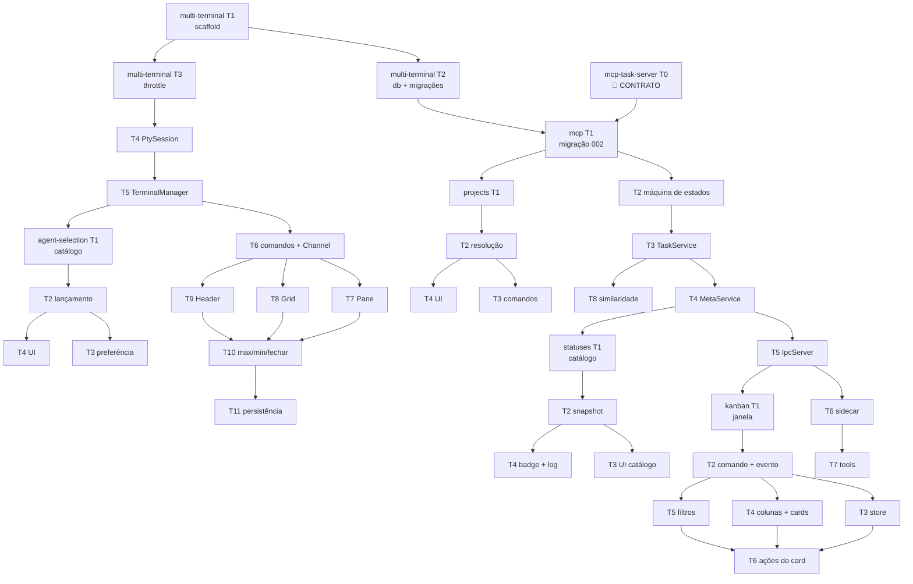

# Ordem de execução — M1 + M2

As tarefas vivem em `features/<feature>/tasks.md`. Este documento é o único lugar que mostra as **dependências entre features** — que os arquivos individuais só referenciam de passagem.

**38 tarefas.** 13 podem rodar em paralelo; 25 são sequenciais.

*(Corrigido na triagem 001 — 28/07/2026. Dizia "37 tarefas, 12 paralelas", mas a contagem de headers `### T` nos seis `tasks.md` de M1/M2 dá 38, e os marcadores `[P]` dão 13 — que é exatamente a lista enumerada no fim deste documento. A conta 12+25=37 fechava sozinha e por isso ninguém notou.)*

---

## Ordem global

---

## Onda a onda

| Onda | Tarefas | Paralelo | Entrega |
|---|---|---|---|
| **0** | `mcp/T0` | — | Contrato de ferramentas congelado. **Gate de bloqueio.** |
| **1** | `mt/T1` | — | Repositório compila e abre janela |
| **2** | `mt/T2`, `mt/T3` | — ¹ | Banco com migrações + throttle testado |
| **3** | `mt/T4` → `mt/T5` → `mt/T6` | — | **PTY funcionando de ponta a ponta** |
| **4** | `mt/T7`, `mt/T8`, `mt/T9` | ✅ 3× | Terminal visível e utilizável |
| **5** | `mt/T10` → `mt/T11` | — | Grid completo, layout persistido |
| **6** | `ag/T1` → `ag/T2` | — | Agente escolhido roda na sessão |
| **7** | `ag/T3`, `ag/T4` | ✅ 2× ² | **Fim do M1** — 4 agentes em grid |
| **8** | `mcp/T1` → `T2` → `T3` | — | Tarefas persistem, regra de fase aplicada |
| **9** | `pr/T1` → `pr/T2`; `mcp/T8` | ✅ com onda 10 | Projetos resolvidos por diretório |
| **10** | `pr/T3`, `pr/T4` | ✅ 2× | UI de projetos |
| **11** | `mcp/T4` → `T5` | — | IPC local no ar, com validação de terminal |
| **12** | `mcp/T6` → `mcp/T7` | — | **Agente já fala com o app** |
| **13** | `ts/T1` → `ts/T2` | — | Catálogo editável + snapshot por sessão |
| **14** | `ts/T3`, `ts/T4` | ✅ 2× | Badge e log visíveis |
| **15** | `kb/T1` → `kb/T2` | — | Janela do board + dados |
| **16** | `kb/T3`, `kb/T4`, `kb/T5` | ✅ 3× | Board renderizando e sincronizando |
| **17** | `kb/T6` | — | **Fim do M2** — laço completo |

¹ `mt/T3` só depende de `mt/T1` e poderia acompanhar `mt/T2`, mas `mt/T2` tem `Tests: integration` (não paralelizável) e `mt/T3` é curta — sequência mantida de propósito.
² `ag/T3` é `cargo test` e `ag/T4` é Vitest: suítes distintas, sem recurso compartilhado. Seguro. `ag/T3` **nunca** em paralelo com outra tarefa `integration` de Rust.

---

## Marcos demonstráveis

| Depois de | Dá para mostrar |
|---|---|
| Onda 4 | Um terminal real dentro do app, com `vim` funcionando |
| Onda 7 | **M1 pronto** — 4 agentes em grid, layout persistido |
| Onda 12 | Um agente cria uma tarefa sozinho, sem UI de board ainda |
| Onda 17 | **M2 pronto** — agente cria tarefa, muda status, e o card anda no board sozinho |

---

## Regras de paralelismo

Por `codebase/TESTING.md`:

- Tarefa com `Tests: integration` **nunca** recebe `[P]` — disputam arquivo SQLite, endpoint de socket ou processos reais
- Tarefas Vitest são livremente paralelizáveis entre si
- Uma tarefa `cargo test` e uma Vitest podem coexistir: suítes distintas, sem estado compartilhado

**13 tarefas paralelizáveis**: `mt/T7-T9`, `ag/T3-T4`, `pr/T3-T4`, `mcp/T8`, `ts/T3-T4`, `kb/T3-T5`. *(A lista sempre teve 13 itens; o número escrito dizia 12. Conferido por `grep '\[P\]'` na triagem 001.)*

---

## Faixa transversal — `release-distribution`

As 21 tarefas de `features/release-distribution/tasks.md` **não entram nas ondas acima**: elas não competem por arquivo com nenhuma tarefa do M1/M2 e têm ritmo próprio.

| Bloco | Relação com as ondas |
|---|---|
| **A — Validação** (`rd/T1–T3`, `rd/T20`, `rd/T21`) | Pode rodar **em paralelo a qualquer onda**. Toca só `scripts/`, `.github/` e o `Cargo.toml` da raiz. Quanto antes entrar, mais cedo as ondas seguintes ganham um check vermelho quando quebram algo |
| **B — Empacotamento** (`rd/T4`, `rd/T5`) | Idem. `rd/T5` é passo humano e é gate de `rd/T9` e `rd/T10` |
| **C — Release** (`rd/T6–T12`) | Só faz sentido depois da **onda 7** (fim do M1) — antes disso não há o que valha a pena instalar |
| **D — Update no app** (`rd/T13–T19`) | Depois da onda 7. `rd/T13` (`paths.rs`) idealmente **antes** de `mt/T11` (persistência de layout), que é o primeiro consumidor de caminho de dados |

**Dois pontos de contato reais, e é só isso:**

1. **`rd/T13` × `mt/T11`** — `mt/T11` persiste o layout e precisa saber onde o banco mora. Se `rd/T13` vier antes, `mt/T11` só consome `paths::db_path`. Se vier depois, `rd/T13` terá que reformar o caminho que `mt/T11` montou. **Recomendado: `rd/T13` antes da onda 7.**
2. **`rd/T14` × `mcp/T1`** — as duas criam uma migração e as duas assumiriam o número `002`. Quem executar primeiro fica com a `002`; a outra pega a seguinte e **atualiza o próprio `tasks.md`** no mesmo commit. Registrado como Todo no `STATE.md`.

Nenhuma tarefa com gate `pipeline` (`rd/T2`, `rd/T6`, `rd/T9–T12`, `rd/T19`, `rd/T21`) é paralelizável com outra do mesmo gate: todas disputam a mesma branch e o mesmo histórico de execuções do GitHub Actions.

---

## Ferramentas por tarefa

Todas as 37 tarefas do M1/M2 declaram **MCP: NENHUM · Skill: NENHUMA**.

Não é omissão. As tarefas são escrita de Rust e React com testes locais — nenhum MCP instalado neste ambiente (`superbullet-ai`, `godot-ai`) tem relação com o trabalho, e nenhuma skill instalada se aplica. Se algum servidor MCP útil for adicionado depois (por exemplo, um de documentação de crates), revisar esta seção antes de executar.
